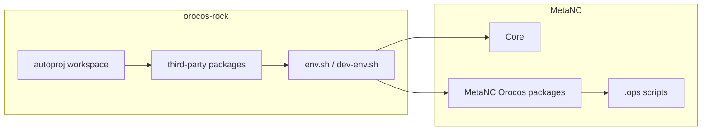

# Architecture

This repository is the toolchain boundary between MetaNC and Orocos/Rock.

## Decision

`orocos-rock` is MetaNC-specific in its first version.

That means it is allowed to encode:

- MetaNC package pins
- MetaNC fork choices
- MetaNC install assumptions
- MetaNC validation steps

It should still keep its scope narrow: third-party toolchain only.

## Dependency Boundary

## `orocos-rock` Responsibilities

- select the minimal Orocos/Rock package set needed by MetaNC
- point selected packages at maintained forks
- keep `ocl` enabled
- keep RTT scripting enabled
- provide `orogen`, `typegen`, and related generator tooling
- install a usable runtime prefix
- install a usable development environment
- document upgrade and validation workflow

## MetaNC Responsibilities

- define canonical CNC domain types
- implement realtime control logic
- implement MetaNC Orocos typekits and components
- own deployment scripts and runtime integration behavior
- own top-level CMake and test workflow

## Runtime Model

The runtime model remains Orocos-based:

- `deployer-gnulinux`
- OCL
- RTT scripting
- RTT components and typekits
- `.ops` deployment scripts

Rock is used here as:

- bootstrap and dependency management via `autoproj`
- generator stack provisioning
- optional reusable low-level libraries

Rock is not used here as:

- the primary deployment framework
- the primary orchestration model
- a replacement for Orocos RTT

## Interface Contract

MetaNC should depend on the installed result of `orocos-rock`, not on its
workspace internals.

The stable downstream contract is:

- one install prefix
- one runtime environment script
- one development environment script

MetaNC may assume that sourcing the development environment is sufficient to:

- find Orocos and OCL tools
- run `orogen`
- run `typegen`
- configure and build MetaNC Orocos packages

## Non-Goals

- vendor third-party source code into this repository
- duplicate MetaNC package build logic here
- make MetaNC depend on Syskit, Roby, or `tools/orocos.rb`
- define CNC semantics in Rock shared packages
