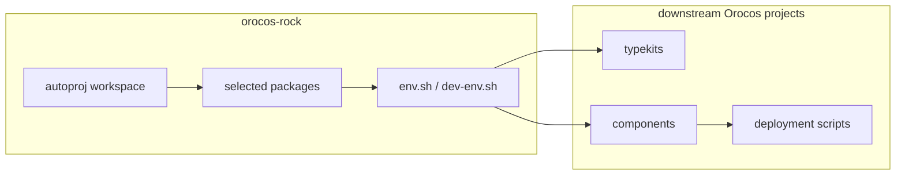

# Architecture

This repository is a standalone toolchain boundary for rebuilding a focused
Orocos/Rock stack on current Linux distributions.

## Decision

`orocos-rock` is public toolchain infrastructure.

That means it is allowed to encode:

- a minimal Orocos/Rock package set
- public fork choices for packages that need maintenance
- branch pins for compiler and distribution compatibility work
- install-prefix assumptions
- validation steps for runtime and generator tools

It should still keep its scope narrow: Orocos/Rock toolchain only.

## Dependency Boundary

## `orocos-rock` Responsibilities

- select a minimal Orocos/Rock package set for RTT, OCL, and generator tooling
- point selected packages at public maintenance forks when upstream does not
  build cleanly on the target distribution
- keep `ocl` enabled
- keep RTT scripting enabled
- provide `orogen`, `typegen`, and related generator tooling
- install a usable runtime prefix
- install a usable development environment
- document upgrade and validation workflow

## Downstream Responsibilities

- define application domain types
- implement application control logic
- implement project-specific typekits and components
- own deployment scripts and runtime integration behavior
- own top-level build and test workflow

## Runtime Model

The runtime model remains Orocos-based:

- `deployer-gnulinux`
- OCL
- RTT scripting
- RTT components and typekits
- `.ops` deployment scripts

Rock is used here as:

- bootstrap and dependency management via `autoproj`
- generator stack provisioning
- optional reusable low-level libraries

Rock is not used here as:

- the primary deployment framework
- the primary orchestration model
- a replacement for Orocos RTT

## Interface Contract

Downstream projects should depend on the installed result of `orocos-rock`, not
on its workspace internals.

The stable downstream contract is:

- one install prefix
- one runtime environment script
- one development environment script

Downstream projects may assume that sourcing the development environment is
sufficient to:

- find Orocos and OCL tools
- run `orogen`
- run `typegen`
- configure and build downstream Orocos packages

## Non-Goals

- vendor third-party source code into this repository
- duplicate downstream package build logic here
- make downstream projects depend on Syskit, Roby, or `tools/orocos.rb`
- define application semantics in Rock shared packages
