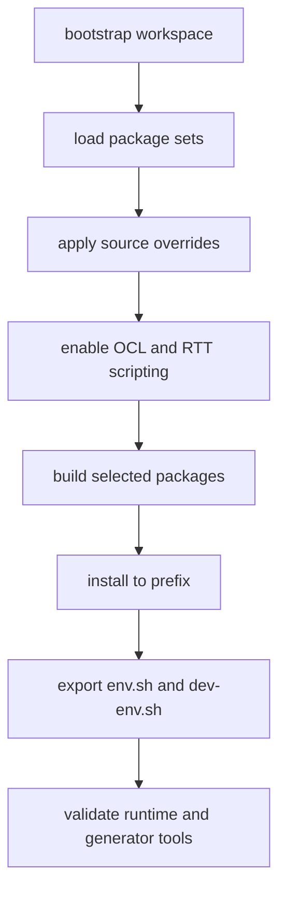

# Bootstrap Workflow

This page defines the expected lifecycle of the `orocos-rock` workspace.

## Goal

Produce one installed Orocos/Rock toolchain that downstream projects can consume
as a normal dependency.

## Workspace Model

The repository root is both:

- the source-controlled control plane of the toolchain
- the root of the autoproj workspace

Tracked content defines policy.

Generated workspace content records the current build state.

## High-Level Flow

## Detailed Steps

1. Bootstrap the autoproj workspace.
2. Load the minimal package set needed for RTT, OCL, and generator tools.
3. Apply source overrides for public maintenance forks.
4. Ensure `ocl` is included.
5. Ensure RTT scripting is enabled.
6. Build runtime packages.
7. Build generator packages.
8. Install to the chosen prefix.
9. Export `env.sh`.
10. Export `dev-env.sh`.
11. Run validation commands.

## Configuration Inputs

The workspace should be controlled by a small number of inputs:

- install prefix
- package selection
- fork overrides
- branch pins
- rebuild or refresh mode

These inputs should be encoded in tracked files or explicit script parameters,
not in undocumented local shell state.

## Update Workflow

When package policy changes:

1. update tracked workspace config
2. run `autoproj reconfigure`
3. rebuild affected packages
4. reinstall the prefix
5. rerun validation

## Validation Checklist

Minimum validation after bootstrap and install:

- `deployer-gnulinux` is available
- OCL-based deployment still works
- RTT scripting is enabled
- `orogen` is available
- `typegen` is available
- a downstream Orocos package can source `dev-env.sh` and configure a build

## Failure Handling

If a package fails:

- first decide whether the package is truly required in phase 1
- if required, patch it in a public maintenance fork or pin a known-good
  revision
- if not required, remove it from the initial workspace scope

Do not compensate for a missing generator stack by switching immediately to a
manual typekit implementation.

## First Implementation Scope

Phase 1 should stop after:

- runtime toolchain works
- generator toolchain works
- deployer and RTT scripting work
- downstream Orocos packages can build against the installed result

Do not expand into higher-level Rock orchestration packages in the first phase.
