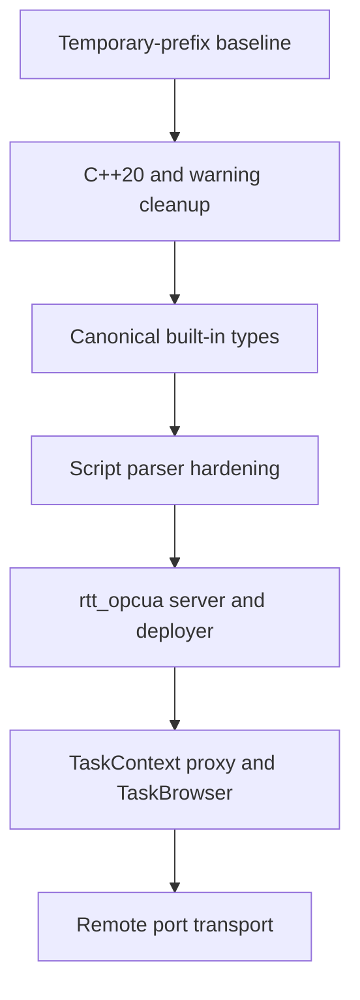

# C++20 And OPC UA Modernization Design

This document defines the approved modernization of the standalone
Orocos/Rock toolchain. The work replaces the C++17 baseline, canonicalizes RTT
built-in type names, hardens the RTT scripting engine, and adds a generic OPC
UA remote-object transport.

> [!IMPORTANT]
> This is toolchain work. The implementation must not contain MetaNC types,
> service names, deployment policy, or application semantics.

## Goals

- require C++20 throughout the maintained C++ toolchain
- fix compiler warnings in maintained sources and generated code
- expose one canonical set of RTT built-in type names
- keep valid RTT scripting behavior while making invalid console input safe
- add a generic OPC UA remote deployer and `TaskContext` transport
- retain the existing CORBA sources while keeping CORBA disabled
- validate all work through a temporary install prefix

## Non-Goals

- preserve legacy RTT built-in type names as aliases
- preserve source compatibility for `ServiceRequester::requires()`
- make OPC UA network communication hard realtime
- add application-specific OPC UA contracts
- add OPC UA publication modes or per-resource allowlists
- add PKI, access control, or non-loopback OPC UA listening
- rewrite the scripting grammar during the initial hardening work
- remove the dormant CORBA implementation

## Isolation And Repository Model

Development uses a root worktree on branch `codex/orocos-modernization`. Every
existing Autoproj package that is modified also uses a linked worktree on a
package-local branch with the same name. This prevents changes in nested Git
repositories from leaking into the current workspace.

The standalone OPC UA implementation is a new public source package:

```text
https://github.com/liufang-robot/rtt_opcua.git
```

The root workspace selects that package through Autoproj. Modified packages
use `liufang-robot` remotes for this work.

All setup, build, install, and downstream smoke tests use an explicit
directory under `/tmp` containing:

```text
temporary-home/
build-state/
logs/
prefix/
```

No command may install into or source an environment from `~/.orocos`. Build
configuration and logs are checked for accidental references to that prefix.

> [!CAUTION]
> The existing workspace may contain user changes and package checkouts. The
> modernization worktrees must not modify, clean, or reset them.

## Delivery Order

The work follows a dependency-ordered sequence so failures remain attributable
to one behavioral change.



Each stage has focused tests and reviewable commits. Later stages consume only
interfaces established by earlier stages.

## Canonical Built-In Types

RTT registers the following canonical type catalog:

| RTT type name | C++ type |
| --- | --- |
| `Bool` | `bool` |
| `Int8` | `std::int8_t` |
| `UInt8` | `std::uint8_t` |
| `Int16` | `std::int16_t` |
| `UInt16` | `std::uint16_t` |
| `Int32` | `std::int32_t` |
| `UInt32` | `std::uint32_t` |
| `Int64` | `std::int64_t` |
| `UInt64` | `std::uint64_t` |
| `Float32` | `float` |
| `Float64` | `double` |
| `Char` | `char` |
| `String` | `std::string` |
| `Void` | `void` |

Fixed-width integer registrations, operators, constructors, conversions, and
transport hooks move into the RTT built-in typekit. The separate
`stdint_typekit` package is removed from the workspace manifest, overrides,
policy checks, CI, test scripts, and install documentation.

Legacy RTT names such as `int`, `short`, `uint`, `llong`, `int16`, `double`,
`string`, and `void` are not registered as compatibility aliases. C++ source
may continue to use `int`, `short`, standard typedefs, or application typedefs;
when a C++ type is identical to a canonical fixed-width type on a supported
platform, RTT resolves it to the canonical `TypeInfo`.

This policy intentionally changes script-visible declarations. For example:

```text
var int count        -> var Int32 count
var double gain      -> var Float64 gain
var string component -> var String component
```

Old identifiers produce a clear unknown-type error. Bundled scripts, examples,
generator fixtures, and documentation migrate to the canonical catalog.

Tests verify the exact catalog, the absence of legacy registrations, numeric
operators and conversions, generated typekit behavior, and numeric treatment
of `Int8` and `UInt8` rather than character formatting.

## C++20 And Warning Policy

C++20 becomes the required implementation and downstream-consumption baseline
for all maintained C++ packages. Installed CMake targets advertise that
requirement, and oroGen/typekit output compiles as C++20.

`ServiceRequester::requires()` is renamed to `requests()` throughout RTT, OCL,
generators, tests, examples, and dormant CORBA call sites. The old spelling is
not retained because `requires` is a C++20 keyword.

The compatibility pass removes C++20-invalid or deprecated library facilities,
including `std::unary_function`, and audits the selected package set for other
removed APIs and language constructs.

Clean GCC and Clang builds establish the warning inventory. The policy is:

- fix warnings in maintained package sources
- fix the generator when generated code causes a warning
- mark genuine external headers as system dependencies
- avoid blanket warning suppression
- document a narrow exception only when an external dependency cannot
  reasonably be corrected
- enable `-Werror` for maintained code after its baseline is clean

The warning cleanup stays evidence-driven. It does not authorize unrelated
style rewrites or broad API redesign.

CORBA remains configured `OFF`, is not installed, and is not part of the
required test matrix. Straightforward references to renamed RTT APIs are still
updated in its dormant sources.

## Scripting Safety Contract

The initial hardening retains Boost Spirit Classic and the existing RTT
grammar. Replacing the parser at the same time as changing error behavior would
create unnecessary compatibility risk.

Every console expression is handled transactionally:

1. parse and semantic actions operate on temporary state
2. type and operation contracts are validated before evaluation
3. the top-level parser verifies that all non-skipped input was consumed
4. state is committed only after complete success
5. every failure discards the temporary state
6. the next console command starts from a known-good parser state

Standalone expression, condition, and value-statement entry points must reject
a valid prefix followed by unconsumed input. Only trailing input recognized by
the configured skip grammar, such as whitespace, may remain. The error points
at the first unconsumed character.

For example, this is one invalid console command, not two calls:

```text
service.first(0)service.second(0)
```

It must execute neither `first` nor `second`. Multiple program statements
remain valid only where the script grammar defines an explicit statement
boundary, such as a newline in an `.ops` program.

User input must not reach unchecked semantic-stack access, null dereferences,
unsafe casts, or process-terminating assertions. Member and index expressions,
operation arity, argument conversions, result types, and data-source
availability are checked before use.

Exceptions are contained at script and TaskBrowser boundaries and converted to
structured errors with useful source context. A malformed command may fail,
but it must not crash, hang, corrupt parser state, or terminate the deployer.

Regression coverage includes:

- malformed and incomplete operation calls
- adjacent valid expressions without a statement boundary, with side-effect
  checks proving that neither expression ran
- chained member and index expressions
- non-indexable values and invalid indices
- unknown operations, services, members, and types
- incorrect operation arity and incompatible arguments
- empty input and deeply nested input
- a valid recovery command after every rejected command

Input size and nesting limits prevent stack exhaustion and pathological parse
cost. Parser tests run under AddressSanitizer and UndefinedBehaviorSanitizer.
An optional fuzz target and seed corpus exercise parsing and expression
evaluation for a bounded verification period.

Valid `.ops` grammar and behavior remain compatible except for the approved
built-in type-name migration.

## Generic OPC UA Package

`rtt_opcua` is transport infrastructure, not an application gateway. It uses
`open62541` through `open62541pp` and exports installed artifacts comparable to
the RTT CORBA transport:

```text
orocos-rtt-opcua-<target>
rtt-transport-opcua-<target>
```

OCL detects the package optionally. A build without OPC UA remains supported.
When enabled, OCL provides an OPC UA deployment service and a
`deployer-opcua` executable.

### Information Model

The server publishes a stable `urn:orocos:rtt` namespace for:

- components
- recursively nested services
- operations
- properties
- attributes
- typed port metadata
- model revision and lifecycle state

Publishing a component exposes its entire interface supported by `rtt_opcua`,
including supported nested services, operations, properties, attributes, and
ports. The migration does not add administrative or restricted publication
modes, and it does not define per-component resource allowlists.

Namespace indexes are resolved dynamically. Stable NodeIds encode names with a
defined escaping policy rather than embedding unescaped component or service
names. The model reconciles additions, changes, and removals automatically;
clients do not call a manual refresh method.

Operation execution is delegated to the correct RTT execution context with a
bounded timeout. Arbitrary component code does not run directly on the OPC UA
server thread. Callback boundaries map failures to OPC UA status codes and do
not allow C++ exceptions to escape.

Server bindings use guarded lifetime handles. Component or service unload must
not leave callbacks holding dangling raw pointers.

The first type protocols cover the canonical built-in catalog. Custom and
generated typekits register additional OPC UA protocols through RTT's
transport extension mechanism.

### Migration Security Scope

`deployer-opcua` binds to loopback (`127.0.0.1` and/or `::1`). The initial
migration rejects non-loopback startup.

> [!WARNING]
> A remote deployer can import libraries, load components, and invoke arbitrary
> exported operations. It is a remote-code-execution surface by design.

PKI, certificate trust stores, signed and encrypted SecurityPolicies,
AccessControl, session or user permissions, and non-loopback listening are not
part of this migration. They require a separate future security design. That
design must distinguish application trust and SecureChannel protection from
authorization of browse, read, write, and method calls.

## Remote TaskContext Proxy

The second OPC UA milestone implements `RTT::opcua::TaskContextProxy`. It is
constructed from an endpoint URL and remote component name and recreates the
remote component's service hierarchy, operations, properties, attributes, and
typed port interfaces as local RTT proxy objects.

The proxy supports synchronous calls and RTT `send`/`collect` behavior through
asynchronous OPC UA requests with bounded timeouts. An OCL deployment service
creates proxies and adds them as normal deployer peers.

`ctaskbrowser-opcua` connects this proxy to the existing TaskBrowser. It reuses
the hardened RTT scripting engine and does not introduce a second console
grammar.

A model revision allows proxy metadata to update atomically. Disconnects,
timeouts, server restarts, and remote unloads transition explicit connection
state and reject affected calls without destabilizing the local deployer.
Initial discovery uses endpoint URL plus component name. OPC UA discovery
services may be added later without changing the proxy API.

## Remote Port Transport

The first functional data plane uses OPC UA client/server methods and
subscriptions. OPC UA PubSub is a future performance option, not a prerequisite
for behavioral replacement of CORBA remote ports.

Remote port direction is preserved:

- remote output ports feed local RTT input ports through subscriptions
- local RTT output ports write through proxy input ports into remote RTT input
  ports

The server creates explicit connection sessions with a defined lifecycle.
Network work runs on non-realtime workers and crosses RTT boundaries through
bounded queues. Realtime activities never perform network I/O or wait for an
OPC UA response.

The initial policy supports `ConnPolicy::DATA` and `ConnPolicy::BUFFER`,
including explicit buffer size and drop behavior. Unsupported connection
policies are rejected rather than silently approximated.

Samples carry a sequence number, source timestamp, and status so clients can
observe gaps and disconnects. Connection sessions are torn down when either
component, port, proxy, or OPC UA session disappears. Reconnection revalidates
endpoint identity, direction, and type compatibility, and does not silently
replay stale samples.

> [!NOTE]
> The bridge preserves RTT port behavior where defined, but OPC UA networking
> is not a hard-realtime transport.

## Verification Matrix

The implementation is complete only when the following checks pass from the
temporary environment:

| Area | Required evidence |
| --- | --- |
| Isolation | No setup, source, install, configuration, or log reference uses `~/.orocos` |
| Language | Clean GCC and Clang C++20 builds for maintained packages |
| Warnings | Maintained-source and generated-code warning gate passes |
| Types | Exact canonical catalog; legacy names absent; generated typekit smoke test passes |
| Scripts | Unit/regression tests, valid-command recovery, ASan/UBSan, bounded fuzz run |
| OPC UA server | Cross-process browse, call, read/write, lifecycle, timeout, loopback-only binding, and non-loopback rejection tests |
| Proxy | Cross-process synchronous and asynchronous calls, model update, disconnect, and reconnect tests |
| Ports | Bidirectional data, buffering, overload, type mismatch, teardown, and reconnect tests |
| Install | Runtime and development environments work from the `/tmp` prefix |
| Downstream | Generated component and typekit configure, build, and run against the installed prefix |
| CORBA | No CORBA binary or library is built or installed |

Documentation includes migration guidance for built-in type names,
`requests()`, the C++20 requirement, OPC UA configuration, the loopback-only
security scope, and an explicit CORBA-to-OPC-UA parity matrix.

## Commit And Integration Policy

Commits remain scoped to the stage they implement. The root branch records
workspace policy and package selection; package branches own their code and
tests. The `rtt_opcua` repository owns all generic OPC UA transport code.

The experimental MetaNC `codex/opcua-remote-deployer` worktree is a read-only
reference. No code is modified there, and application-specific code is not
copied into the toolchain package.
