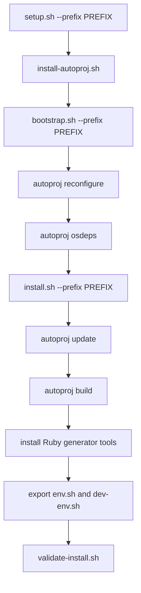

# Maintainer Guide

This page is for people who maintain the `orocos-rock` dependency workspace.
The maintainer's job is to produce one installed Orocos/Rock prefix that MetaNC
can consume as a normal third-party dependency.

## Maintainer Principles

- The install prefix is the public contract.
- `.autoproj/`, package checkouts, and build directories are workspace state.
- Package selection belongs in tracked Autoproj configuration.
- Fork choices belong in tracked overrides.
- Wrapper scripts should make the workflow repeatable, not hide new policy.
- Changes to `rock-orocos` land through pull requests. Do not push directly to
  `main` during normal maintenance.

## Script Flow

| Script | What it does | Main output |
|---|---|---|
| `tools/setup.sh` | User-facing wrapper that runs Autoproj install, bootstrap, install, and validation in order | A validated installed prefix |
| `tools/install-autoproj.sh` | Installs Autoproj into the current user's RubyGems area if `autoproj` is not already usable | User gem executables, usually under RubyGems' user bin directory |
| `tools/bootstrap.sh` | Generates local Autoproj workspace config, runs `autoproj reconfigure`, and optionally installs OS dependencies | `.autoproj/config.yml`, `.autoproj/Gemfile`, `.autoproj/bin/*`, refreshed package-set state |
| `tools/install.sh` | Updates forked packages, refreshes source-declared OS dependencies, builds the selected package layout, stages Ruby generator tools, and exports environment scripts | Built packages under the configured prefix plus `env.sh` and `dev-env.sh` |
| `tools/export-env.sh` | Regenerates prefix environment scripts without rebuilding packages | `PREFIX/env.sh`, `PREFIX/dev-env.sh` |
| `tools/validate-install.sh` | Sources the exported environments and checks required runtime and generator commands | A pass/fail validation of the installed prefix |
| `tools/docker-build.sh` | Builds the clean-room Docker image using the tracked Dockerfile | Local Docker image, default tag `orocos-rock:ubuntu-24.04` |

## Install Sequence



The normal host prefix is `~/.orocos`. The Docker image uses `/opt/orocos`.
In Docker builds, root is used only for OS package installation, `ubuntu` user
creation, and ownership setup. The wrapper scripts run as the `ubuntu` user.

The native CI workflow runs the wrapper scripts in standard Linux containers.
The required CI matrix currently covers Ubuntu 22.04, Ubuntu 24.04, and Debian
13/Trixie. Ubuntu 26.04 is tracked as the next compatibility target once the CI
runtime is available and validated.

The clean-room Docker workflow is manual-only. It remains useful for local image
validation and release-style smoke tests, but it is not the primary PR gate.

The Docker image is multi-stage. Autoproj, source checkouts, build directories,
and `/opt/orocos-rock` exist only in the builder stage. The final image copies
the installed prefix, keeps the OS and Ruby packages needed to use that prefix,
and validates that `deployer-gnulinux`, `orogen`, and `typegen` work without an
Autoproj workspace.

## What Gets Installed Or Changed

| Layer | Installed or generated content | Owner | Notes |
|---|---|---|---|
| OS packages | Build tools, CMake, Boost libraries, omniORB, XML tools, Ruby, Python, `pkg-config`, and package-specific Autoproj osdeps such as ncurses development headers | System package manager | `bootstrap.sh` and `install.sh` may invoke `autoproj osdeps`, which can call `sudo apt-get install` |
| User RubyGems | Autoproj and compatibility gems such as Facets when needed | Current user | `install-autoproj.sh` does not edit shell startup files; it prints a `PATH` line if needed |
| Workspace state | `.autoproj/config.yml`, `.autoproj/Gemfile`, `.autoproj/bin/bundle`, package-set remotes, generated Autoproj state | `orocos-rock` workspace | Generated state. Do not commit it |
| Source checkouts and builds | Autoproj-managed package checkouts and build results for `log4cpp`, `rtt`, `ocl`, `orogen`, `typelib`, `utilmm`, `utilrb`, `rtt_typelib`, and `stdint_typekit` | `orocos-rock` workspace and install prefix | Package list starts in `autoproj/manifest` |
| Install prefix | `PREFIX/toolchain`, `PREFIX/bin`, `PREFIX/lib*`, `PREFIX/share`, `PREFIX/env.sh`, `PREFIX/dev-env.sh`, and staged Ruby generator tools | Public toolchain prefix | This is what MetaNC should consume |
| Logs | `PREFIX/log` and Autoproj logs | Local install prefix | Useful for debugging failed osdeps, build, and install steps |

## Environment Scripts

| Script | Purpose | Variables it sets or prepends |
|---|---|---|
| `env.sh` | Runtime environment for deployer and installed components | `OROCOS_ROCK_PREFIX`, `PATH`, `LD_LIBRARY_PATH`, `CMAKE_PREFIX_PATH`, `PKG_CONFIG_PATH`, `RTT_COMPONENT_PATH`, `OROCOS_TARGET` |
| `dev-env.sh` | Development environment for MetaNC builds and generators | Sources `env.sh`, then sets `GEM_HOME`, `GEM_PATH`, and `RUBYLIB` for installed Ruby generator tooling |

`env.sh` and `dev-env.sh` prepend paths only when the target directory exists.
They are designed to be sourced repeatedly without duplicating path entries.

## Tracked Policy Inputs

| File | Responsibility |
|---|---|
| `autoproj/manifest` | Selected package layout |
| `autoproj/overrides.yml` | Package source overrides and maintained fork URLs |
| `autoproj/overrides.rb` | Autoproj package setup hooks |
| `autoproj/manifests/*.xml` | Local package manifest metadata needed during bootstrap |
| `docs/src/package-policy.md` | Human-readable package and fork policy |

Before adding a package, update the policy first and confirm that MetaNC really
needs the package to build or run.

## Maintainer Validation

After changing scripts, package policy, or Docker support, run:

```bash
ruby tools/check-autoproj-policy.rb
ruby tools/check-clean-room-docker.rb
bash -n tools/common.sh tools/bootstrap.sh tools/install.sh tools/export-env.sh tools/validate-install.sh
bash -n tools/setup.sh tools/docker-build.sh
```

After changing CI policy, run:

```bash
ruby tools/check-native-ci.rb
ruby tools/check-package-tests-ci.rb
```

After a real install, run:

```bash
./tools/validate-install.sh --prefix ~/.orocos
```

Then validate from a MetaNC checkout by sourcing `~/.orocos/dev-env.sh` before
configuring MetaNC.
