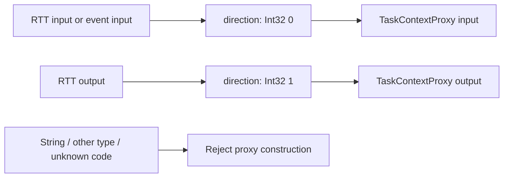

# OPC UA Port Direction Protocol Design

Date: 2026-08-14

Status: Approved for implementation

## Purpose

Define one strict wire representation for RTT data-port direction in the
`urn:orocos:rtt` OPC UA model.

The current mapping publishes free-form strings. Port direction is a finite
protocol concept, so the mapping will instead publish documented integer enum
codes. The publisher and `TaskContextProxy` must consume the same shared enum
definition and ship together.

> [!IMPORTANT]
> This is an intentional breaking wire-schema revision. A new proxy rejects a
> legacy string-valued `direction` node. There is no dual-format migration
> path.

## Scope

This design covers only the `direction` metadata Variable below each mapped
RTT data-port Object. It does not change:

- port sample types or transfer methods;
- `FlowStatus` or `WriteStatus` codes;
- generated same-named RTT port services;
- category selection or publication policy;
- OCL deployment behavior; or
- SDK implementation outside this repository.

Dedicated OPC UA Enumeration DataTypes, `MultiStateDiscreteType`,
`EnumStrings`, and localized enum labels are deferred.

## Shared Protocol Type

`rtt_opcua` will install one focused protocol header containing:

```cpp
namespace RTT::opcua {

enum class PortDirection : std::int32_t {
  input = 0,
  output = 1,
};

} // namespace RTT::opcua
```

Both object-model publication and proxy discovery use this type. The explicit
underlying type and values prevent the two sides from drifting.

The enum is transport metadata. It is not an RTT sample type and therefore
does not require an RTT typekit or an OPC UA transport protocol registration.

## Wire Contract

The deterministic NodeId remains unchanged:

```text
rtt/components/<component>/ports/<port>/direction
rtt/components/<component>/services/<service>/ports/<port>/direction
```

The Variable contract is:

| Attribute | Value |
| --- | --- |
| NodeClass | `Variable` |
| DataType | OPC UA built-in `Int32` |
| ValueRank | scalar |
| AccessLevel | current read only |
| UserAccessLevel | current read only |
| TypeDefinition | `BaseDataVariableType` |
| Parent reference | `HasComponent` |

The values are:

| Code | `PortDirection` | Published RTT port |
| ---: | --- | --- |
| `0` | `input` | `RTT::InputPort<T>` or event input port |
| `1` | `output` | `RTT::OutputPort<T>` |

Direction is always from the published component's perspective. The
server-side anti-port has the opposite direction but does not affect this
metadata.

Event input is not a third direction. RTT's maintained public introspection
does not expose stable event classification, so an event input publishes code
`0` like every other input port.

## Publisher Behavior

The publisher classifies each mapped port before committing its component
snapshot:

1. An `RTT::base::InputPortInterface` publishes `PortDirection::input`.
2. An `RTT::base::OutputPortInterface` publishes `PortDirection::output`.
3. A port that matches neither interface, or ambiguously matches both, is an
   unsupported resource and makes strict publication fail.

There is no `unknown` enum value. Publishing an ambiguous numeric value would
hide an invalid RTT interface and leave clients unable to choose the correct
sample-transfer method.

The direction Variable uses a dedicated read-only scalar `Int32` `NodeSpec`.
Its fingerprint includes the metadata kind and numeric value. Retained NodeIds
do not change, while the component snapshot fingerprint changes intentionally
with the schema revision.

## Proxy Behavior

Proxy discovery reads the direction Variant and validates its wire shape
before creating a local RTT port:

1. The Variant must be scalar.
2. Its OPC UA datatype must be exactly built-in `Int32`.
3. Code `0` reconstructs a proxy input port.
4. Code `1` reconstructs a proxy output port.
5. Every other code fails proxy construction.

Strings, other integer widths, floating-point values, arrays, and unknown
codes are rejected. The proxy must not convert or guess.

Diagnostics distinguish transport failures from schema failures:

- a missing or unreadable node reports failure to read RTT port direction
  metadata and retains the OPC UA status;
- a non-scalar or non-`Int32` value reports that scalar `Int32` was expected;
- an unsupported code reports the port name and numeric code.

The port data-plane method schema is still validated after direction decoding.
An input must expose `write(value) -> WriteStatus`; an output must expose
`read() -> (FlowStatus, value)`.



## Compatibility

This revision deliberately rejects the previous string contract:

```text
"input"  -> rejected
"output" -> rejected
```

The server publisher and `TaskContextProxy` changes therefore belong in one
`rtt_opcua` protocol commit and release. Operators must upgrade both endpoint
sides together.

No compatibility alias, secondary metadata node, string fallback, or
capability negotiation is added. Supporting both formats would make schema
validation weaker and extend a representation that is already known to be
incorrect for a finite protocol value.

## Verification Contract

Maintained tests must prove:

- input direction is scalar `Int32` code `0` and read only;
- output direction is scalar `Int32` code `1` and read only;
- event input direction is scalar `Int32` code `0`;
- `TaskContextProxy` reconstructs input and output ports from those codes;
- a legacy string direction is rejected;
- an unknown `Int32` code is rejected;
- a different numeric datatype is rejected rather than converted;
- existing input/output transfer-method validation still passes;
- the complete `rtt_opcua` suite and OCL OPC UA integration suite remain
  green; and
- the retained temporary interface probe reads integer direction metadata
  while preserving its direct data-plane and TaskBrowser behavior checks.

No OCL production mapping logic is needed. OCL continues to call the generic
`rtt_opcua::ObjectModel` and consume `TaskContextProxy`.

## Deferred Work

A later, separately reviewed revision may introduce a dedicated OPC UA
Enumeration DataType or `MultiStateDiscreteType` with browseable labels. That
work must define datatype NodeIds, enum metadata ownership, client discovery,
localization, and compatibility. It is not necessary for the stable `Int32`
contract defined here.
