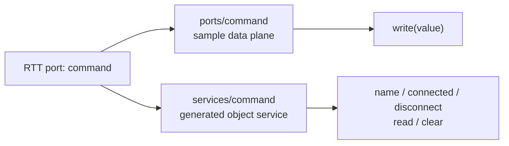

# OPC UA RTT Interface Mapping Design

Date: 2026-08-13

Status: Draft for review

## Purpose

Define the complete, generic mapping from an Orocos RTT `TaskContext` into the
`urn:orocos:rtt` OPC UA address space.

The mapping is independent of publication policy. It first describes every RTT
resource faithfully. A future selector, filter, authorization rule, or user
permission may choose which mapped resources are visible, but it must not
change what an RTT resource means or how that resource is represented.

> [!IMPORTANT]
> A same-named `ports/<name>` and `services/<name>` pair is intentional. The
> former transfers samples; the latter exposes RTT's generated port adapter as
> an ordinary service. Publication policy may select either one later.

## Scope And Boundary

This is generic Orocos/Rock toolchain work owned by `rtt_opcua` and consumed by
OCL's OPC UA deployer and remote `TaskContextProxy`. It must not depend on
MetaNC, recognize application naming conventions, or classify an application
resource as public or internal.

This design covers:

- component identity and lifecycle metadata;
- operations;
- properties;
- attributes and constants;
- input, output, and event input ports;
- services at arbitrary supported nesting depth; and
- RTT-generated port service adapters.

The existing static, strict, transactional publication and component-lifetime
contract remains in force. This design does not add dynamic reconciliation,
unpublication, replacement, access control, or a selector syntax.

## Mapping Principles

### Complete before selective

`rtt_opcua` constructs one complete typed snapshot of the supported RTT
interface. It does not omit resources because they look internal, have a name
such as `*_in`, or are generated by RTT.

Publication selection is a later transformation over this complete resource
model. Selection must be able to distinguish resource paths, but it must not
introduce a second implementation of operation, value, port, or service
mapping.

### Recursive service rule

Every `RTT::Service` is mapped by the same recursive function. At each service
level, the function maps:

```text
service
|- operations
|- properties
|- attributes
|- ports
`- services
```

A component's root `provides()` object is the root service. A custom child
service, a nested child service, and an RTT-generated port service adapter all
use the same rule.

### Separate data and object planes

An RTT port participates in two real RTT interfaces:

1. The data-flow interface transports typed samples and preserves port
   direction and connection behavior.
2. RTT creates a same-named service adapter for scripting and introspection
   when port data scripting is enabled.

OPC UA maps both interfaces. They share the same underlying RTT port but are
not duplicates:

```text
ports/<port>       data-plane endpoint and port metadata
services/<port>    RTT-generated object/service adapter
```

The service traversal must therefore stop filtering a child service merely
because a same-named port exists.



## Address-Space Organization

The namespace URI remains `urn:orocos:rtt`. Logical NodeIds retain the current
escaped, deterministic path scheme:

```text
rtt/components/<component>
  lifecycleState
  operations/<operation>
  properties/<property>
  attributes/<attribute-or-constant>
  ports/<port>
  services/<service>/...
```

Each path segment is percent-escaped independently. Category segments make a
same-named port and service unambiguous. Empty category folders remain present
at each published service level so clients can browse one stable schema.

## Component Mapping

Each published `TaskContext` creates one component object below
`rtt/components`.

The component object contains:

- the component name and description as OPC UA object metadata;
- a read-only `lifecycleState` variable;
- the five stable category objects; and
- the recursively mapped contents of `component.provides()`.

`lifecycleState` is transport metadata needed by `TaskContextProxy`; it is not
an RTT attribute and does not appear below `attributes`.

## Operation Mapping

Each RTT operation becomes one OPC UA Method below the owning service's
`operations` object.

The mapping preserves:

- operation name and documentation;
- ordered input arguments;
- return value;
- mutable reference arguments returned during collect;
- canonical RTT type names as method metadata;
- OPC UA datatype NodeIds and value ranks; and
- RTT execution context and bounded call timeout.

The existing operation dispatcher remains the single implementation for root,
custom-service, nested-service, and generated-port-service operations.
Component code never runs directly on the OPC UA server thread. Exceptions and
conversion failures are translated to OPC UA status codes.

Every argument, return value, and collected mutable output must have a
registered RTT-to-OPC-UA codec. One unsupported operation makes strict
component preflight fail before any component nodes are committed.

## Property Mapping

Each RTT property becomes one OPC UA Variable below the owning service's
`properties` object.

The mapping preserves:

- property name and documentation;
- canonical RTT type name in an `rttType` metadata property;
- OPC UA datatype and value rank;
- current value; and
- read/write access.

An assignable RTT property is readable and writable. A non-assignable value is
read-only. Reads and writes use the registered type codec and acquire the
published component lifetime guard before accessing RTT storage.

## Attribute And Constant Mapping

Each RTT attribute or constant becomes one OPC UA Variable below the owning
service's `attributes` object.

RTT exposes attributes and constants through the same attribute interface.
Their mutability distinguishes them:

- an assignable data source is a read/write attribute;
- a non-assignable data source is a read-only constant.

The mapping otherwise matches property mapping: it preserves the name,
canonical RTT type, OPC UA datatype, value rank, and current value. Constants
do not require a separate address-space category.

## Port Data-Plane Mapping

Each RTT port becomes one OPC UA Object below the owning service's `ports`
object. The object contains stable metadata:

- `type`: canonical RTT sample type;
- `direction`: `input` or `output` from the published component's perspective;
- `description`: RTT port documentation; and
- the direction-appropriate sample-transfer method.

The server creates and connects an RTT anti-port with `antiClone()`:

| Published RTT port | Server-side counterpart | OPC UA transfer method |
| --- | --- | --- |
| `InputPort<T>` | connected `OutputPort<T>` | `write(value) -> WriteStatus` |
| `OutputPort<T>` | connected `InputPort<T>` | `read() -> (FlowStatus, value)` |
| event `InputPort<T>` | connected `OutputPort<T>` | `write(value) -> WriteStatus` |

For an event input port, writing through the counterpart follows the original
RTT connection and trigger behavior. Event input is not a third port direction.
Current RTT public introspection presents an event input as an input port and
does not provide a stable event-classification query, so OPC UA does not invent
an `event` direction or metadata flag. A future RTT API could add that metadata
without changing the transfer method.

The counterpart crosses between OPC UA's non-realtime worker and RTT through a
bounded connection. OPC UA callbacks do not perform network work from a
realtime activity.

`TaskContextProxy` recreates a remote port with its original declared
direction. Normal RTT connection rules then provide the counterpart at the
caller: a local output connects to a proxy input, while a proxy output connects
to a local input.

### Port status types

`FlowStatus` and `WriteStatus` are RTT enum concepts and require canonical
OPC UA codecs so the generic operation mapper and the dedicated port data plane
use one type contract.

Until a dedicated OPC UA Enum datatype is reviewed, both use documented
`Int32` codes:

| RTT type | Code | Meaning |
| --- | ---: | --- |
| `FlowStatus` | `0` | `NoData` |
| `FlowStatus` | `1` | `OldData` |
| `FlowStatus` | `2` | `NewData` |
| `WriteStatus` | `0` | `WriteSuccess` |
| `WriteStatus` | `1` | `WriteFailure` |
| `WriteStatus` | `2` | `NotConnected` |

The data plane must stop maintaining a separate string encoding of these
statuses. Server methods, proxy adapters, ordinary operations, and generated
port service operations all use the registered codecs.

### Compatibility rule

Replacing the current data-plane status strings with `Int32` enum codes is an
intentional method-schema revision. The server publisher, remote port adapter,
and proxy discovery changes must ship together. A proxy must validate the
discovered method arguments and results and reject an incompatible endpoint
with a concrete diagnostic; it must not guess based on a returned string or
integer and must not expose two status encodings.

## Port Object-Service Mapping

When RTT port data scripting is enabled, `addPort()` and `addEventPort()` add a
same-named child `RTT::Service`. That service is mapped exactly like a custom
service and remains distinct from the port data-plane object.

The standard generated interface includes:

| Port kind | Generated operations |
| --- | --- |
| input or event input | `name`, `connected`, `disconnect`, `read`, `clear` |
| output | `name`, `connected`, `disconnect`, `write`, `last` |

The actual generated interface discovered from RTT is authoritative; the OPC
UA mapper does not hard-code this table or synthesize operations. Future RTT
versions may add or remove adapter resources, and the ordinary recursive
service mapper handles them.

Examples of the two coexisting views are:

```text
ports/command
  type
  direction = input
  description
  write(value)

services/command
  operations/name
  operations/connected
  operations/disconnect
  operations/read
  operations/clear
```

Calling an adapter operation has the exact RTT behavior. In particular,
`read` may consume a component input sample, `write` writes through a component
output port, and `disconnect` changes RTT connections. Mapping is descriptive,
not an authorization boundary; later publication and authorization policy may
restrict these operations.

## Nested Service Mapping

For every genuine or generated child service:

1. Create an OPC UA Object below the owning `services` object.
2. Preserve its name and documentation.
3. Create its five category objects.
4. Map its operations, properties, attributes/constants, and ports.
5. Recurse into its child services.

Traversal remains cycle-safe and bounded by the maintained maximum service
depth. RTT's reserved `this` lookup is a self-alias, not a child service, and
is deliberately ignored. Any other repeated service pointer in the current
ancestry, or any service beyond the supported depth, rejects preflight with a
diagnostic containing the offending service path. The mapper must not silently
truncate the public model.

## Snapshot, Failure, And Lifetime Rules

The complete mapping participates in the existing publication transaction:

1. Snapshot the component and recursively discover all resources.
2. Validate resource identity, type codecs, method schemas, and NodeIds.
3. Report every unsupported resource using its complete service/resource path.
4. Commit the complete component subtree only when preflight succeeds.
5. Roll back nodes and close callback state if insertion unexpectedly fails.

The snapshot fingerprint includes both port data-plane nodes and generated
port service nodes. Publishing the same live component instance is an
idempotent no-op; publishing a different interface under the same component
name remains rejected.

All callbacks use the existing guarded component state. A published component
cannot be unloaded while either its data-plane or object-plane callbacks are
reachable.

## Client And Proxy Contract

`TaskContextProxy` discovers and recreates both planes:

- port metadata creates and pumps typed proxy ports;
- recursive service discovery creates ordinary RTT services and operations,
  including same-named generated port service adapters;
- properties, attributes, and constants retain their writability; and
- lifecycle metadata maintains the proxy task state.

A service and a port may legally share a name. Proxy installation must retain
both instead of allowing one representation to replace or suppress the other.
The port remains registered through the local data-flow interface; the service
remains registered through the local object interface.

## Non-Goals

This design deliberately does not decide:

- which component or resource is public;
- selector or filter grammar;
- allowlist versus deny-list behavior;
- user- or role-specific browse/read/write/call permissions;
- application-specific internal-resource conventions;
- public stop, unpublish, replacement, or reconciliation operations; or
- OPC UA PubSub transport.

Those layers consume this mapping and must not redefine it.

## Automated Test Contract

Maintained `rtt_opcua` tests use one generic fixture with:

- root and nested operations, including arguments, return values, and mutable
  outputs;
- a writable property;
- a writable attribute;
- a read-only constant;
- an input port, output port, and event input port;
- the RTT-generated service for each port;
- a custom child service containing all resource kinds; and
- a second nested custom service.

Tests prove:

1. Every resource appears at its deterministic path with correct metadata.
2. The same recursive mapping works at the root and both service depths.
3. Each port appears in both the `ports` and `services` categories.
4. Input and event-input data-plane writes reach the original RTT port.
5. Output data-plane reads preserve value and `FlowStatus`.
6. Generated adapter operations are callable through the generic operation
   dispatcher and preserve RTT behavior.
7. `FlowStatus` and `WriteStatus` use the canonical integer codecs end to end.
8. `TaskContextProxy` recreates same-named port and service resources together.
9. One unsupported nested resource rejects the complete component snapshot.
10. Existing rollback, idempotence, timeout, lifetime, and shutdown tests still
    pass.

OCL integration tests prove that `opcua.publishComponent(name)` exposes this
complete model without adding deployment-specific mapping logic.

## Temporary Manual Probe

Implementation acceptance also uses a fresh, untracked directory below
`/tmp`. The probe contains:

```text
/tmp/rtt-opcua-interface-probe.<unique>/
|- CMakeLists.txt
|- interface_probe_component.cpp
|- interface_probe_client.cpp
|- probe.ops
`- build/
```

The component uses only canonical built-in types and provides the same surface
matrix as the maintained fixture. The client browses deterministic OPC UA
paths, invokes methods, reads and writes variables, and exercises both port
planes. The `.ops` script imports the probe plugin, loads the component, starts
OPC UA, and explicitly publishes the component.

Manual acceptance must show:

- local TaskBrowser lists every expected RTT resource;
- an OPC UA browse dump lists every expected component and nested-service path;
- values round-trip for properties, attributes, constants, and operations;
- constants reject writes;
- input and event-input samples written through the data plane reach the
  component;
- output samples written by the component are read through the data plane;
- generated input- and output-port service operations are discoverable and
  callable independently of the data plane;
- `ctaskbrowser-opcua` reconstructs both same-named proxy resources; and
- clean endpoint shutdown leaves no running probe process.

The probe must build against an isolated installed prefix produced from the
maintained RTT, `rtt_opcua`, and OCL sources. It must not modify MetaNC or rely
on an application typekit.
