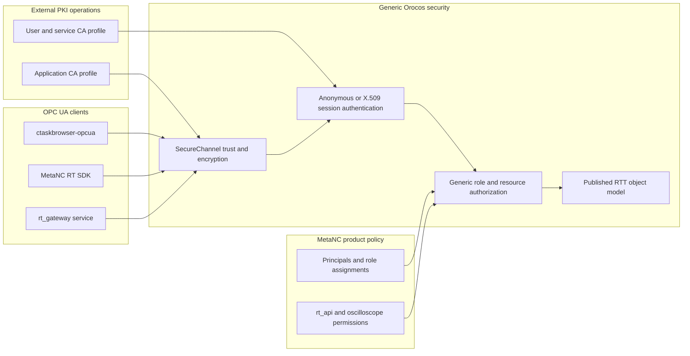

# OPC UA PKI Authentication And Authorization PRD

Status: design approved in discussion; written review pending

Date: 2026-08-11

> [!IMPORTANT]
> This document defines a cross-repository product contract. Orocos provides
> generic OPC UA security mechanisms. MetaNC supplies product identities,
> roles, and access policy. Neither repository becomes a certificate authority.

## Problem Statement

The current native OPC UA integration is suitable for isolated loopback use,
but it does not yet provide a complete production security model. A client can
connect to a published RTT object graph without a product-defined distinction
between an anonymous caller, a named developer, an administrator, or an
unattended service. The server also lacks an approved contract for encrypted
non-loopback connections and certificate trust.

MetaNC needs two independent controls:

1. Authentication decides whether a session is anonymous or proves an X.509
   identity with a private key.
2. Authorization decides what the authenticated principal may browse, read,
   write, call, or subscribe to.

These controls must not be confused with OPC UA application authentication.
Every production client and server also needs an application certificate to
establish a trusted, signed, and encrypted SecureChannel. An anonymous user
session can therefore still run over a mutually authenticated encrypted
channel. Anonymous is not equivalent to a named user such as Alice and does
not imply an unencrypted connection.

The feature spans two repositories with different architectural boundaries.
`orocos-rock` owns the reusable RTT/OCL OPC UA toolchain, while MetaNC owns the
machine product, its RT SDK, its service identities, and the meaning of
resources such as `rt_api` and `oscilloscope`. Without an explicit ownership
split, generic toolchain code could acquire MetaNC-specific policy, or the RT
SDK could become coupled to Orocos RTT implementation details.

## Solution

Add a three-layer OPC UA security contract:

1. **Application trust and encryption** uses application certificates to
   authenticate client and server applications and establish a
   `SignAndEncrypt` SecureChannel.
2. **Session authentication** independently permits anonymous identity and/or
   X.509 user identity according to server configuration.
3. **Authorization** maps the resulting principal to named roles and evaluates
   explicit policy for browse, observe, write, and call operations. Observe
   covers both direct reads and data-change subscriptions in the first version.

Orocos implements these layers as generic `rtt_opcua`, OCL, and installed
toolchain capabilities. MetaNC consumes those capabilities and defines its
concrete identity and access policy. The MetaNC RT SDK remains an independent
OPC UA client implementation and does not depend on RTT headers or runtime
objects.

## Goals

- Require encrypted and signed OPC UA traffic for production non-loopback
  connections.
- Keep an explicit insecure loopback mode for local development.
- Let a server independently enable or disable anonymous and X.509 user
  authentication.
- Keep application identity separate from human or service identity.
- Deny product resources unless an authorization rule grants the requested
  action.
- Apply the same authorization result to discovery through browse and to
  direct access by NodeId.
- Give `ctaskbrowser-opcua` and every MetaNC RT SDK connection equivalent
  security semantics.
- Keep generic Orocos code free of MetaNC component names, roles, and product
  policy.
- Keep the MetaNC RT SDK independent of Orocos RTT headers and runtime
  implementation.
- Preserve the existing static OPC UA publication lifecycle and whole-component
  publication behavior.
- Validate the feature with temporary certificates and temporary install
  prefixes rather than `~/.orocos`.
- Keep the pinned official open62541 and open62541pp sources unchanged.

## User Stories

1. As a machine operator, I want a non-loopback OPC UA endpoint to require
   signed and encrypted traffic, so that machine commands and telemetry are not
   exposed in plaintext.
2. As a machine operator, I want the client to verify the server application
   certificate, so that it does not connect to an impersonated controller.
3. As a machine operator, I want the server to verify the client application
   certificate, so that only trusted client software installations establish
   production channels.
4. As a local developer, I want an explicit loopback-only insecure mode, so
   that isolated development remains simple without weakening production
   defaults.
5. As a server administrator, I want to enable or disable anonymous sessions,
   so that each deployment can choose whether unauthenticated users exist.
6. As a server administrator, I want to enable X.509 user authentication, so
   that named users and services prove possession of their private keys.
7. As Alice, I want my user certificate to identify me independently of the
   client application's certificate, so that authorization follows my identity
   rather than the workstation alone.
8. As an anonymous user, I want the system to treat me as the anonymous
   principal, so that I never inherit Alice's or another named user's roles.
9. As an anonymous user, I want any permitted session to use the same encrypted
   channel requirements as a named session, so that anonymous does not mean
   plaintext.
10. As a normal developer, I want access to the approved `rt_api` resources, so
    that I can develop and diagnose normal machine integration.
11. As a normal developer, I want access to `oscilloscope` resources denied, so
    that elevated diagnostic capabilities remain restricted.
12. As an administrator, I want access to both `rt_api` and `oscilloscope`, so
    that I can perform complete commissioning and diagnosis.
13. As a product owner, I want anonymous access limited to explicitly public
    discovery or status resources, so that enabling anonymous does not expose
    the machine interface.
14. As an `rt_gateway` operator, I want the gateway to use a dedicated service
    identity, so that an unattended process does not borrow a human
    certificate.
15. As an `rt_gateway` operator, I want its role limited to the resources the
    gateway actually needs, so that service compromise does not imply
    administrator access.
16. As a TaskBrowser user, I want `ctaskbrowser-opcua` to load my application
    and user security profiles, so that interactive remote access can use the
    production endpoint.
17. As a TaskBrowser user, I want distinct diagnostics for an untrusted server,
    rejected client application, failed user authentication, and denied
    operation, so that I can correct the right configuration.
18. As an RT SDK application developer, I want security settings in the SDK
    connection configuration, so that applications do not implement their own
    open62541 security setup.
19. As an RT SDK application developer, I want discovery, command, monitor, and
    oscilloscope connections to use the same supplied identity, so that helper
    connections cannot silently bypass or weaken security.
20. As an RT SDK API consumer, I want authentication and authorization failures
    represented as stable SDK errors, so that applications can distinguish
    policy denial from a network outage.
21. As a certificate administrator, I want every application instance to have
    its own private key, so that one leaked key can be revoked without replacing
    every client.
22. As a certificate administrator, I want private keys generated and retained
    on the machine that uses them, so that certificate signing never requires
    transferring private key material.
23. As a certificate administrator, I want separate application and user CA
    profiles, so that trusting client software does not automatically grant a
    user role.
24. As a certificate administrator, I want trust lists, issuers, and revocation
    lists validated before startup, so that an invalid production security
    configuration fails closed.
25. As a certificate administrator, I want certificate and policy changes to
    take effect on restart, so that the first version has a predictable static
    configuration lifecycle.
26. As a security reviewer, I want authorization applied independently to
    browse, observe, write, and call, so that a broad browse grant does not
    accidentally permit value access, mutation, or operation execution.
27. As a security reviewer, I want direct NodeId requests checked even when a
    node was hidden during browse, so that knowledge of an identifier does not
    bypass policy.
28. As a security reviewer, I want denied actions and authenticated principal
    information logged without private keys or credentials, so that access can
    be audited safely.
29. As an Orocos maintainer, I want a generic authorization boundary, so that
    `rtt_opcua` can be reused by products other than MetaNC.
30. As an Orocos maintainer, I want whole-component publication to remain
    separate from authorization, so that security does not introduce a second
    publication lifecycle.
31. As a MetaNC maintainer, I want product roles and resource rules owned in the
    MetaNC repository, so that machine policy can evolve without forking the
    generic toolchain.
32. As a MetaNC maintainer, I want the RT SDK to use its direct OPC UA backend,
    so that the SDK remains independent of RTT runtime implementation.
33. As a toolchain maintainer, I want security behavior tested through the
    installed prefix, so that downstream users do not rely on workspace-only
    state.
34. As a toolchain maintainer, I want open62541 and open62541pp consumed at the
    approved pinned versions without source patches, so that dependency
    ownership remains clear.
35. As a CI maintainer, I want keys, certificates, homes, and install prefixes
    created under temporary directories, so that tests are isolated and leave
    no persistent credentials.

## Product Requirements

### Security Layers

| Layer | Identity | Evidence | Decision |
|---|---|---|---|
| Application trust | Server or client application instance | Application certificate and proof of its private key | Whether a trusted encrypted SecureChannel may be established |
| Session authentication | Anonymous, human, or service principal | Anonymous token or X.509 user certificate and proof of its private key | Which principal owns the session |
| Authorization | Principal plus named roles | Static product policy | Whether an OPC UA action is permitted for a resource |

- Application and user certificates are separate credentials with separate
  purposes. Possessing a trusted application certificate does not grant a user
  role.
- A production anonymous session still requires a trusted application channel.
- A named human or service session does not exist until the X.509 user token is
  validated against the user trust configuration.
- The server may enable anonymous authentication, X.509 user authentication, or
  both. A production configuration must enable at least one session identity
  method.
- The anonymous principal receives only anonymous roles. It is never treated as
  a fallback for a rejected X.509 identity.
- User and service certificates carry a unique URI identity issued under the
  organization's user CA policy. Display names are informational and are not
  sufficient as authorization keys.

### SecureChannel Profiles

Two explicit operating profiles are required:

1. **Insecure loopback development** permits an unencrypted endpoint only on a
   loopback address. It must be explicitly selected and must not bind a
   non-loopback interface.
2. **Secure production** requires trusted application certificates,
   `Basic256Sha256`, and `SignAndEncrypt` for operational sessions.

The secure profile has these requirements:

- It does not expose a `Sign`-only operational endpoint.
- A `None` endpoint, when retained for OPC UA endpoint discovery, must not be
  usable to activate an operational session or access the RTT object model.
- A client must select the required policy and mode explicitly and must not
  silently retry with weaker security.
- The server certificate application URI must match its configured application
  URI and certificate identity.
- Client application certificates must be trusted by the server application
  trust configuration.
- Server application certificates must be trusted by every production client.
- Expired, not-yet-valid, revoked, malformed, or identity-mismatched
  certificates are rejected.

### Connection Flow

The production connection sequence is:

1. The client obtains endpoint descriptions and the server application
   certificate.
2. The client validates the server certificate chain, validity, revocation
   state, application URI, and endpoint identity against its application trust
   configuration.
3. The client and server negotiate the required security policy and
   `SignAndEncrypt` mode. The client presents its application certificate and
   proves possession of its application private key as part of the secure
   application exchange.
4. The server validates the client application certificate against its
   application trust configuration. A successful exchange establishes an
   encrypted SecureChannel but grants no product role.
5. The client creates and activates a session. It deliberately selects either
   an anonymous token or an X.509 user token.
6. For an X.509 user token, the client presents the user certificate and signs
   the server nonce with the separate user private key. The server validates
   that signature and validates the user certificate with the user trust
   configuration.
7. Session authentication creates the anonymous, human, or service principal
   and attaches its configured roles to the session.
8. Every subsequent browse, observe, write, or call request is evaluated
   against that session principal and the requested resource.

Failure at one layer does not fall back to a weaker layer. In particular, a
rejected named identity does not become anonymous, and a rejected secure policy
does not retry through an unencrypted endpoint.

### Session Authentication

- X.509 user authentication validates the full certificate chain, validity,
  revocation status, and proof of possession before assigning a principal.
- Application and user trust stores are evaluated independently even when they
  chain to a common organizational root.
- Interactive clients use a human user identity.
- Unattended processes use distinct service identities.
- Client libraries do not ship a universal application key, user key, or
  administrator identity.
- Failed X.509 authentication does not downgrade to anonymous. A caller must
  deliberately start a new anonymous session if anonymous is enabled.

### Authorization

- Generic authorization evaluates the tuple of principal, named roles,
  resource identity, and requested action.
- Supported actions are browse, observe, write, and call. Observe controls both
  direct value reads and data-change subscriptions because the pinned
  open62541 access-control surface applies one user access level to both.
- The default for a product resource without a matching grant is deny.
- Browse filtering and direct service requests enforce the same policy.
- Parent browse access does not imply child observe, write, or call access.
- Authorization denials return an OPC UA access-denied status without crashing
  the server or disconnecting an otherwise valid session.
- Authorization applies to the already published RTT object model. It neither
  selects components for publication nor changes the static publication graph.
- Orocos accepts a generic static policy or policy provider. It does not know
  MetaNC role or component names.
- A secure production endpoint must not use the dependency's implicit
  grant-all access-control configuration. An allow-all development policy, if
  needed, is explicit and limited to the loopback development profile.

Authorization rules target stable semantic resource identities. For published
RTT resources, the identity consists of the OPC UA namespace URI, component
instance path, resource kind, and nested service/resource path. The publication
layer retains the mapping between these identities and runtime NodeIds so the
access-control layer can evaluate direct NodeId requests. Product rules do not
depend on namespace indexes, generated numeric identifiers, or source-tree
layout.

Standard OPC UA server and discovery nodes use a minimal generic platform
policy needed for protocol operation. Product namespace nodes use product
policy. A product node that cannot be mapped to a stable resource identity is
denied rather than treated as public.

The initial MetaNC policy contract is:

| Principal class | Initial access |
|---|---|
| Anonymous | Standard OPC UA discovery plus explicitly designated public status resources only |
| Developer | Approved `rt_api` resources; no `oscilloscope` resources |
| Administrator | All published MetaNC resources, including `rt_api` and `oscilloscope` |
| `rt_gateway` service | Only the `rt_api` resources required by the gateway; no implicit administrator or oscilloscope access |

MetaNC may refine resource groups and role assignments without changing the
generic Orocos authorization interface. A policy change still requires an
endpoint restart in this version.

### Provisioning And Configuration

- Certificate authorities are external operational infrastructure. Neither
  Orocos nor MetaNC issues or signs production certificates.
- Application and user identities use separate CA profiles or intermediate
  authorities. They may chain to the same organizational root.
- A new server or client machine generates its application private key locally,
  creates a certificate signing request with a unique application URI and
  applicable DNS/IP identities, and installs the returned signed certificate.
- A human or service identity separately generates or receives its user
  private key and certificate under the user CA policy.
- Only certificate signing requests and public certificates leave the machine
  during normal enrollment. Private keys remain local.
- The supported first-version exchange format is documented DER certificates
  with PEM private keys. Operator documentation must include generation,
  inspection, conversion, trust installation, and revocation-list update
  examples using standard OpenSSL tools.
- Private key files require restrictive operating-system permissions.
- Server configuration includes its application certificate and key, trusted
  client application issuers, revocation material, accepted session identity
  methods, trusted user issuers, and the generic authorization policy.
- Client configuration includes the endpoint, required security policy and
  mode, client application certificate and key, trusted server issuers and
  revocation material, and an optional user certificate and key.
- Security configuration is validated before the OPC UA endpoint starts.
- Certificate, trust, authentication, and authorization configuration is frozen
  while the endpoint runs. Applying changes requires process or endpoint
  restart.

### Client Behavior

- `ctaskbrowser-opcua` accepts a security profile that supplies application
  trust and optional X.509 user identity.
- `TaskContextProxy` exposes equivalent generic client security configuration
  for other Orocos clients.
- MetaNC extends its transport-neutral RT SDK connection configuration with an
  OPC UA security profile without exposing RTT types.
- Every OPC UA client created for one RT SDK connection, including bootstrap,
  discovery, command, monitor, and oscilloscope clients, uses the same selected
  application and session identity.
- Applications embedding the RT SDK supply deployment-specific credentials.
  The SDK library contains no default private key or product-wide certificate.

### Failure And Audit Behavior

- Invalid production configuration fails closed before the endpoint accepts an
  operational connection.
- Clients report distinct failure categories for local credential
  configuration, endpoint negotiation, untrusted server, rejected client
  application, user authentication, required policy/mode mismatch, and
  authorization denial.
- RT SDK authentication and authorization errors remain stable public error
  categories and are not converted into generic timeout or transport errors.
- Logs may include certificate thumbprints, application URI, principal URI,
  roles, target resource, action, and decision.
- Logs never include private key contents, private key passphrases, raw
  authentication tokens, or complete sensitive credential files.
- Repeated authorization denial does not trigger automatic connection fallback
  or weaker authentication.

## Implementation Decisions

### Orocos And `orocos-rock`

- `rtt_opcua` owns reusable server application PKI, client application PKI,
  anonymous/X.509 session authentication, principal extraction, and generic
  authorization enforcement.
- The generic authorization contract addresses browse, observe, write, and call
  operations over the published RTT object model. Observe covers reads and
  subscriptions in this dependency baseline.
- `TaskContextProxy` owns the reusable secure client option surface used by
  Orocos clients.
- OCL passes server security configuration into `deployer-opcua` and client
  security configuration into `ctaskbrowser-opcua`.
- OCL reports configuration, authentication, and authorization failures in the
  terminology visible to TaskBrowser users.
- `orocos-rock` owns dependency selection, package wiring, installed-prefix
  documentation, temporary-prefix validation, and generic integration
  fixtures.
- RTT core does not acquire OPC UA PKI or MetaNC authorization policy.
- The implementation uses the approved open62541 access-control and security
  extension surfaces through open62541pp or its public native handle boundary.
  It does not patch either third-party dependency.
- The broad convenience server configuration that enables multiple security
  policies and endpoint modes is insufficient for the production profile. The
  server must install only the explicitly approved operational policy and mode,
  plus any tightly constrained discovery-only endpoint.

### MetaNC

- MetaNC owns application URI naming, human and service principal naming, role
  definitions, certificate-to-principal assignments, and the policy that groups
  product resources.
- MetaNC policy targets the generic stable resource identities exported by
  `rtt_opcua`; it does not encode runtime namespace indexes or generated numeric
  NodeIds.
- MetaNC owns the initial anonymous, developer, administrator, and `rt_gateway`
  access rules.
- MetaNC owns deployment configuration that supplies server credentials,
  trust material, enabled identity methods, and authorization policy to the
  Orocos endpoint.
- MetaNC extends the direct open62541pp RT SDK backend with equivalent client
  application trust and X.509 user authentication.
- The RT SDK remains independent of RTT, OCL, `TaskContextProxy`, and Orocos
  workspace internals.
- MetaNC owns stable SDK error mapping, product audit context, packaging of
  public trust material, and secret injection into deployed applications.
- MetaNC owns integration validation for `rt_api`, `oscilloscope`, and
  `rt_gateway` behavior.

### External PKI Operations

- Operations owns CA private keys, certificate profiles, signing approval,
  certificate inventory, trust distribution, revocation, and renewal
  procedures.
- Operations provisions unique application credentials per deployed server and
  client application instance.
- Operations provisions distinct human and service credentials rather than
  sharing one administrator certificate.
- Operations decides how production secrets are delivered and protected on a
  machine while satisfying the file-based first-version contract.

### Responsibility Matrix

| Capability | Orocos / `orocos-rock` | MetaNC | External PKI operations |
|---|---|---|---|
| SecureChannel implementation | Owns generic server/client mechanism | Configures and consumes | Issues trusted application certificates |
| Anonymous and X.509 session authentication | Owns generic mechanism | Selects enabled methods | Issues user/service certificates |
| Principal and role authorization engine | Owns generic enforcement boundary | Owns principals, roles, and resource grants | Defines certificate issuance identity policy |
| `ctaskbrowser-opcua` | Owns secure CLI/client support | May package deployment profiles | Provisions operator credentials |
| RT SDK | No dependency or implementation ownership | Owns all client integration | Provisions application and service/user credentials |
| `rt_api` and `oscilloscope` permissions | Must not contain these names | Owns policy and acceptance tests | No resource-policy ownership |
| CA, enrollment, revocation, renewal | Documents required inputs only | Integrates deployed artifacts | Owns operational process |
| Third-party OPC UA libraries | Pins and consumes unchanged versions | Consumes compatible installed contract | No source ownership |

## Testing Decisions

Tests verify externally observable protocol and policy behavior rather than the
shape of internal configuration objects or callback implementations.

### Orocos Test Seam

- Build and install the selected toolchain into a fresh temporary prefix.
- Generate an ephemeral application CA, user CA, server identity, multiple
  client application identities, and user/service identities below a temporary
  directory.
- Start a real `rtt_opcua` server with a generic fixture object graph and use
  real clients over loopback with production security enabled.
- Prove a trusted `Basic256Sha256` `SignAndEncrypt` connection succeeds.
- Prove an operational `None` or `Sign`-only connection cannot be used in the
  secure profile.
- Prove untrusted, expired, revoked, and application-URI-mismatched certificates
  fail for both server and client trust directions.
- Prove anonymous disabled, anonymous enabled, valid X.509 identity, invalid
  X.509 identity, and no-downgrade behavior.
- Use generic fixture roles and resources to prove independent browse, observe,
  write, and call grants and denials. Prove that denied observe access blocks
  both direct reads and subscription values.
- Prove direct NodeId requests cannot bypass browse filtering.
- Prove authorization denial returns an access-denied result while the valid
  session remains usable for permitted resources.
- Exercise the secure client path through `TaskContextProxy` and
  `ctaskbrowser-opcua`.
- Verify logs contain useful identity and decision metadata without credential
  contents.
- Run maintained `rtt_opcua` and OCL tests; do not configure or build
  open62541/open62541pp unit tests.
- Verify both GNU/Linux packaging and the Xenomai build contract without making
  security logic part of a real-time execution path.

### MetaNC Test Seam

- Validate RT SDK security configuration before any backend client connects.
- Prove bootstrap, discovery, command, monitor, and oscilloscope clients all use
  the same supplied application and session identity.
- Prove an anonymous session sees only the configured public status subset.
- Prove a developer can use approved `rt_api` resources and receives access
  denied for `oscilloscope`.
- Prove an administrator can use both resource groups.
- Prove the `rt_gateway` service identity has only its configured service
  permissions.
- Prove RT SDK results distinguish authentication failure, authorization
  denial, trust failure, policy mismatch, and transport failure.
- Prove denied operations do not crash the client, trigger insecure fallback,
  or enter an inappropriate transport retry loop.
- Prove MetaNC consumes only the installed `orocos-rock` contract and does not
  reach into its source workspace.

### Cross-Repository Acceptance

- Run one temporary deployment in which `deployer-opcua`,
  `ctaskbrowser-opcua`, and the actual MetaNC RT SDK connect to the same secure
  endpoint and policy.
- Exercise anonymous, developer, administrator, and service identities against
  that endpoint.
- Generate all test keys, certificates, trust stores, homes, and install
  prefixes under temporary directories.
- Leave both repositories clean and leave no test credential or installation
  under `~/.orocos`.

## Acceptance Criteria

- A secure non-loopback-capable endpoint cannot start without valid server
  identity, trust, session-authentication, and authorization configuration.
- Production operational sessions use only `Basic256Sha256` with
  `SignAndEncrypt` in the first version.
- Anonymous and X.509 user authentication are independently configurable.
- Anonymous never inherits a named principal or role.
- A trusted application channel does not by itself grant product access.
- MetaNC developer, administrator, anonymous, and service policy behaves as
  defined in this PRD.
- Browse and direct NodeId access produce consistent authorization results.
- `ctaskbrowser-opcua` and all RT SDK connection paths work with the same PKI
  model and report actionable failures.
- Orocos contains no MetaNC-specific role or resource names in generic security
  implementation.
- MetaNC RT SDK contains no RTT or OCL runtime dependency.
- Third-party OPC UA source remains unchanged and its unit tests remain outside
  the maintained build.
- Automated validation uses temporary state and does not modify `~/.orocos`.

## Out of Scope

- Implementing or embedding a certificate authority.
- OPC UA Global Discovery Server, CMP, or other automatic enrollment.
- Automatic certificate renewal or live trust-list reload.
- OAuth, JWT, LDAP, username/password, or operating-system login integration.
- Dynamic role or policy editing through OPC UA, a web UI, or TaskBrowser.
- TPM, HSM, smart-card, or password-protected private-key integration.
- Delegating an HMI user's personal identity through `rt_gateway`.
- Depending on experimental built-in role-management behavior when a stable
  custom access-control boundary is required.
- A universal certificate, private key, or administrator credential shared by
  installations.
- OPC UA PubSub security, Zenoh security, web TLS, or HMI authorization.
- Publication allowlists, administrative/restricted publication modes,
  unpublication, component replacement, reconciliation, or unload behavior.
- Changing whole-component publication or the static OPC UA graph lifecycle.
- CORBA security or enabling the CORBA build.
- Changes to RTT core.
- Changes to open62541 or open62541pp source code or enabling their test suites.
- A generalized enterprise identity platform beyond the file-based PKI and
  static authorization contract described here.

## Further Notes

- The dependency baseline remains open62541 `v1.4.15` and open62541pp
  `v0.21.2` until a separately reviewed dependency upgrade changes it.
- The first implementation should use static startup configuration. Runtime
  certificate reload, policy reload, unpublication, and component unload need
  separate requirements before implementation.
- A later operator guide should provide concrete OpenSSL commands for private
  key generation, certificate signing requests, certificate inspection,
  PEM/DER conversion, trust installation, and revocation-list handling.
- This PRD intentionally produces two later implementation plans: one for the
  generic Orocos toolchain and one for MetaNC product integration. Approval of
  this PRD does not authorize implementation in either repository.
