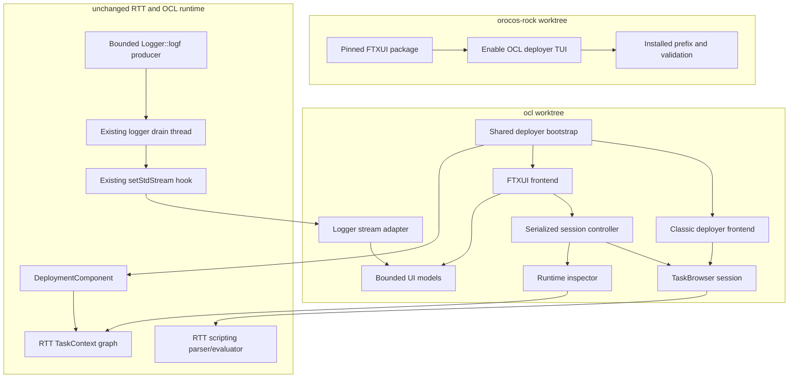

# Deployer TUI Product Requirements And Design

Date: 2026-07-18

> [!IMPORTANT]
> Status: Planned and not implemented. This page is not part of the current
> install contract.

## TODO

- [ ] Extract a headless TaskBrowser session while preserving classic behavior.
- [ ] Add the bounded results, log, history, and runtime snapshot models.
- [ ] Build the FTXUI workbench and serialized command worker.
- [ ] Add pseudo-terminal acceptance coverage and installed-prefix integration.
- [ ] Verify GNU/Linux behavior and Xenomai target parity.

## Problem Statement

The OCL deployer provides a capable interactive TaskBrowser, but the current
terminal experience combines command input, command output, and runtime logging
in one scrolling console. This makes it difficult for an operator to enter a
command while logs are active, retain command results for comparison, or inspect
the live RTT object graph without repeatedly issuing text commands.

Operators need a full-screen terminal interface that preserves the Orocos
deployment model and TaskBrowser language while separating these concerns. The
new interface must be additive. Existing scripts, automation, and users must be
able to continue using `deployer`, `deployer-gnulinux`, and
`deployer-xenomai` unchanged.

## Solution

Add an FTXUI-based OCL executable family:

```text
deployer-tui                  # target-neutral wrapper
deployer-tui-gnulinux         # compiled GNU/Linux executable
deployer-tui-xenomai          # compiled Xenomai executable
```

The TUI uses a Workbench Grid with a persistent runtime browser, command
results, selected-item details, logs, and a dedicated command input. It reuses
the existing deployment, RTT scripting, and TaskBrowser behavior through a new
headless session boundary. The classic console becomes another frontend of that
session boundary and remains behaviorally compatible.

Milestone one is a console and read-only runtime browser. Live observation,
editing, operation forms, and lifecycle controls are separate follow-up work.

## Goals

- Preserve the existing deployer and TaskBrowser command language.
- Preserve the classic TaskBrowser readline/editline input and history path.
- Add target-neutral and target-specific TUI entry points.
- Keep command input, command results, and RTT logs visibly separate.
- Provide read-only navigation of the live RTT object graph.
- Keep the full-screen UI responsive while commands execute.
- Preserve the current bounded real-time logging producer path.
- Build reproducibly from the `orocos-rock` installed prefix.
- Support both `gnulinux` and `xenomai` targets.
- Establish testable session, inspection, logging, and UI boundaries that can
  support a later Observe feature.

## User Stories

1. As an Orocos operator, I want to launch `deployer-tui` without knowing the
   selected target suffix, so that it behaves like the existing `deployer`
   wrapper.
2. As an Orocos operator, I want to run the same XML, CPF, OPS, OSD, and Lua
   startup files accepted by `deployer`, so that deployments do not require a
   TUI-specific format.
3. As an Orocos operator, I want startup logs retained in the Logs pane, so that
   I can diagnose initialization behavior after the screen opens.
4. As an Orocos operator, I want failed startup scripts to leave the TUI
   available for inspection, so that I can examine the partial deployment.
5. As a TaskBrowser user, I want existing commands and RTT expressions to work
   unchanged, so that prior operational knowledge transfers to the TUI.
6. As a TaskBrowser user, I want command history and completion, so that repeated
   command-driven workflows remain efficient.
7. As an operator, I want command results separated from logger traffic, so that
   asynchronous messages do not obscure a command response.
8. As an operator, I want a bounded, scrollable Logs pane that follows new
   records until I scroll away, so that high-volume output remains manageable.
9. As an operator, I want visible dropped-record and UI-buffer overflow status,
   so that I know when displayed logs are incomplete.
10. As an operator, I want a component and peer tree, so that I can understand
    the deployed runtime without repeatedly issuing `ls`.
11. As an operator, I want to expand services, ports, properties, attributes,
    operations, programs, and state machines, so that the live RTT interface is
    discoverable.
12. As an operator, I want selecting a runtime item to update a read-only Details
    pane, so that inspection does not mutate command context.
13. As an operator, I want `Enter` or double-click on a component to activate
    its TaskBrowser context, so that navigation is deliberate.
14. As an operator, I want typed `cd` commands and browser navigation to stay
    synchronized, so that the prompt and tree never describe different active
    contexts.
15. As an operator, I want runtime state and connection changes to refresh
    automatically, so that the browser does not show stale status indefinitely.
16. As an operator, I want the interface to remain responsive during a blocking
    TaskBrowser command, so that logs and terminal redraws continue.
17. As an operator, I want graceful terminal restoration on normal exit and
    exceptions, so that a failed deployer does not leave my shell corrupted.
18. As an automation user, I want help, version, and check modes to remain
    headless, so that scripts can inspect the TUI executable without a terminal
    session.
19. As a maintainer, I want standalone OCL builds to opt into FTXUI explicitly,
    so that the existing OCL dependency surface remains stable.
20. As a toolchain maintainer, I want FTXUI pinned and built by Autoproj, so that
    Ubuntu and Debian package-version differences do not affect the result.
21. As a classic deployer user, I want the current console and wrappers to remain
    available and tested, so that adopting the TUI is optional.
22. As a Xenomai user, I want the same TUI source and command contract as
    GNU/Linux, so that target selection does not change the operator workflow.
23. As a classic TaskBrowser user, I want readline/editline line editing,
    signals, completion, and history persistence to remain unchanged, so that
    the TUI refactor does not degrade the existing console.

## Product Requirements

### Entry Points And CLI

- `deployer-tui` is an installed script wrapper that reads `OROCOS_TARGET` and
  dispatches to `deployer-tui-${OROCOS_TARGET}` using the existing wrapper
  convention.
- OCL builds target-specific binaries through its existing Orocos executable
  macros.
- The TUI accepts the existing deployer startup, site-file, log-level,
  no-consolelog, CPU, RT allocation, help, version, and check options.
- Help, version, and `--check` do not initialize the full-screen interface.
- Interactive mode requires a usable input and output TTY. A missing TTY returns
  a nonzero error that directs the caller to the classic or check mode.
- `--daemon` is rejected before any fork because a full-screen TUI cannot own a
  background terminal.
- `--no-consolelog` prevents RTT console records from entering the Logs pane and
  leaves configured file logging intact.

### Workbench Grid

The selected layout is:

```text
+--------------------------------------------------------------------------+
| OCL Deployer | target | deployment state | startup file status           |
+----------------+------------------------------+---------------------------+
| Runtime        | Command Results              | Selected Item Details     |
| Browser        |                              |                           |
|                +------------------------------+---------------------------+
|                | Logs                                                     |
+----------------+----------------------------------------------------------+
| active_context [state]> command input                                     |
+--------------------------------------------------------------------------+
```

- Browser, result, detail, and log panes are resizable within stable minimum
  dimensions.
- The command input remains visible and has a stable height.
- The interface supports keyboard-first focus and navigation. Mouse selection,
  double-click activation, scrolling, and split resizing are supplementary.
- Full Workbench Grid operation requires at least 80 columns by 24 rows. A
  smaller terminal renders a coherent size requirement screen and continues to
  handle resize and exit events.
- Pane content is clipped or scrolled rather than allowed to resize the layout.

### TaskBrowser Session

- A new internal OCL session boundary owns active context, visit history,
  macro/trace state, command dispatch, evaluation, completion, and result
  emission.
- The session reuses the existing RTT scripting parser and evaluator. It does
  not introduce a second command grammar.
- Built-in handling currently embedded in `TaskBrowser::loop()` moves behind a
  single command execution entry point used by both frontends.
- Mutable session state becomes instance-owned rather than shared static UI
  state.
- Existing public `TaskBrowser` methods remain supported as a compatibility
  facade.
- Session results contain plain command output, diagnostic output, context
  changes, and completion data without FTXUI types.
- Session extraction begins after the classic console has acquired a line. It
  does not replace the classic console's readline/editline input machinery.

### Readline And History Compatibility

> [!IMPORTANT]
> The classic TaskBrowser keeps its existing readline/editline input path. The
> TUI refactor may extract command dispatch and completion-candidate discovery,
> but it must not replace `readline()` with FTXUI or a generic input abstraction
> in the classic console.

- The classic frontend preserves its prompt handling, `rl_gets()` behavior,
  signal integration, readline/editline completion callbacks, ANSI rendering,
  and blocking input loop.
- The classic frontend continues to use the readline/editline history API for
  loading, duplicate suppression, navigation, and writeback.
- `ORO_TB_HISTFILE` remains the history-file override. `.tb_history` and the
  existing home-directory fallback remain compatible.
- Empty commands and `quit` retain their current history behavior.
- Completion-candidate discovery moves behind a reusable session method, while
  the classic frontend keeps its existing readline callback adapter.
- FTXUI owns input editing and key events only in `deployer-tui`. The TUI does
  not invoke interactive `readline()` or install readline signal handlers.
- The TUI uses the same history file selection, line format, duplicate
  suppression, and `quit` exclusion rules as the classic frontend.
- Both frontends preserve history across process restarts. No new TUI-specific
  history file is introduced.

### Command Execution

- The FTXUI event loop never performs TaskBrowser evaluation directly.
- A session controller serializes command and runtime-inspection requests on one
  non-real-time worker.
- Only one command is active at a time. Additional submission is disabled while
  the session reports busy.
- The UI continues rendering and draining log-model updates while a command is
  active.
- Milestone one does not forcibly cancel an executing RTT operation or script.
- Command exceptions become Results diagnostics and do not terminate the UI.

### Runtime Browser And Details

The browser represents the live RTT object model only:

- components and peers
- component state and activity metadata
- services and nested services
- operations
- ports and connection state
- properties and attributes
- programs and state machines

The browser does not include deployment files, plugin libraries, or typekit
catalogs.

- Selection updates Details without changing command context.
- `Enter` and double-click activate a component or peer and update the prompt.
- A typed context-changing command updates browser selection when the target is
  representable in the tree.
- Expanded branches and selected-item details refresh at a nominal 500 ms
  interval through the serialized session worker.
- Inspection prioritizes expanded and selected nodes rather than rebuilding all
  deep metadata on every refresh.
- A removed or unreachable object becomes unavailable in the snapshot and does
  not leave a dangling RTT pointer in the UI model.
- Details show names, documentation, types, current read-only values, lifecycle
  state, activity information, and connection status where applicable.

### Results And Logs

- TaskBrowser output and evaluation diagnostics go to Results.
- RTT records selected for console output go to Logs through the existing
  `RTT::Logger::setStdStream()` hook.
- OCL owns a stream adapter whose lifetime covers logger use by the TUI. The
  adapter frames newline-terminated records and pushes them into a bounded
  4,096-line queue without calling FTXUI.
- The FTXUI thread drains queued lines into a bounded 10,000-line view model.
- The Results view also retains at most 10,000 lines.
- New logs are followed while the view is at the tail. Manual upward scrolling
  pauses follow until the operator returns to the tail.
- Clearing a view removes displayed history only. It does not modify RTT logger
  configuration or `orocos.log`.
- RTT `droppedLogCount()` and TUI queue overflow are displayed separately.
- Logger level and module remain visible in RTT's existing formatted line.
- Milestone one does not parse formatted text to implement structured severity
  or module filters.
- Arbitrary `printf`, `std::cout`, and `std::cerr` output from loaded components
  is unsupported and may interfere with the full-screen terminal. Supported
  components should use `RTT::Logger`.

### Startup And Shutdown

- Common deployer bootstrap logic owns option parsing, Orocos initialization,
  `DeploymentComponent` construction, startup-file processing, shutdown, and
  exit status.
- Existing XML/CPF and OPS/OSD/Lua ordering and failure behavior is preserved.
- The log stream adapter starts collecting before deployment files are
  processed, so startup records are available when rendering begins.
- A startup-file failure still opens the TUI for diagnosis in interactive mode
  and preserves the failing process result.
- Normal exit stops new submissions, waits for the active session request,
  shuts down deployment, drains logs, restores the logger stream, exits Orocos,
  and restores the terminal.
- Terminal and logger ownership use RAII so exceptions follow the same cleanup
  path.
- A command that never returns can delay graceful exit in milestone one because
  forceful cancellation is outside the RTT operation contract.

## Architecture



### Thread Ownership

- The FTXUI thread owns widget state, focus, rendering, and visible model
  mutation.
- The session worker exclusively owns TaskBrowser command execution and runtime
  snapshots for the TUI.
- The existing RTT logger drain thread writes formatted text into the OCL stream
  adapter.
- Cross-thread boundaries carry queued values and refresh notifications. They do
  not expose mutable FTXUI widgets or live browser pointers.
- The RTT log producer path is unchanged. No TUI allocation, lock, callback, or
  dependency appears in real-time logging calls.

## Repository Decisions

### OCL

- Add `BUILD_DEPLOYER_TUI`, default `OFF`.
- Require an installed FTXUI CMake package only when the option is enabled.
- Link FTXUI privately into the TUI executable. No installed OCL public header
  includes FTXUI.
- Add the target-specific executable and target-neutral wrapper using existing
  OCL conventions.
- Extract shared bootstrap and headless TaskBrowser behavior in small,
  regression-tested steps before the FTXUI frontend depends on them.

### orocos-rock

- Add FTXUI as an official-upstream CMake package, initially pinned to `v7.0.1`.
- Do not fork or vendor FTXUI unless a concrete portability issue requires a
  reviewed maintenance patch.
- Add FTXUI to the focused toolchain package set and document why it is needed.
- Enable `BUILD_DEPLOYER_TUI` for the maintained OCL package.
- Extend the installed prefix contract and validation to cover the new wrapper
  and selected target binary.
- Keep FTXUI's source/build details internal to the workspace. Downstream users
  depend on the installed command, not the Autoproj checkout layout.

### RTT

- Create no RTT worktree for milestone one.
- Make no RTT API or implementation changes.
- Consume the existing bounded logger, drain thread, dropped-count API, and
  standard-stream hook.
- Consider a structured non-real-time log-record sink only in a later PRD that
  requires severity/module filtering without text parsing.

## Delivery Milestones

### Milestone 1: Session Extraction And Classic Compatibility

- Create the OCL worktree.
- Introduce the internal session output and command contract.
- Move built-in command dispatch out of the blocking console loop.
- Make mutable browser session state instance-owned.
- Adapt classic TaskBrowser command dispatch to the session contract without
  changing its readline/editline line acquisition, signals, or history owner.
- Prove existing TaskBrowser and deployer behavior with focused regression tests.

### Milestone 2: Toolchain Dependency And TUI Shell

- Create the `orocos-rock` worktree.
- Package and pin FTXUI in Autoproj.
- Add the opt-in OCL build option and target naming.
- Build a minimal TUI shell through the installed prefix.
- Validate terminal initialization, resize handling, and restoration.

### Milestone 3: Command, Results, And Logs

- Add the serialized session controller.
- Implement command input, history, completion, busy state, and Results.
- Implement the logger stream adapter and bounded Logs model.
- Preserve startup logs, file logging, and no-consolelog behavior.

### Milestone 4: Runtime Browser And Details

- Implement read-only runtime snapshots.
- Render the component/service/interface hierarchy.
- Synchronize selection, activation, prompt context, and typed `cd`.
- Handle asynchronous state changes and removed objects.

### Milestone 5: Installation And Target Parity

- Complete GNU/Linux pseudo-terminal integration tests.
- Extend clean-prefix installation and validation.
- Build and smoke-test the Xenomai target.
- Run interactive parity validation on a Xenomai-capable host.
- Document user and maintainer workflows.

Each milestone must leave the classic deployer passing before the next begins.

## Testing Decisions

Tests assert external behavior at the highest stable seam. They use real RTT test
components where practical and do not mock parser implementation details.

### Session Contract Tests

- Reuse and extend the existing TaskBrowser `TestTaskContext` fixture.
- Execute built-ins, context navigation, RTT expressions, invalid commands,
  help, macro/trace behavior, and completion through the session contract.
- Assert emitted results, diagnostics, active context, and history behavior.
- Run classic frontend regression checks against the same session behavior.
- Run the classic TaskBrowser through a pseudo-terminal and verify readline or
  editline line editing, history navigation, tab completion, signal handling,
  duplicate suppression, `quit` exclusion, `ORO_TB_HISTFILE`, and history
  persistence across restarts.

### Runtime Inspector Tests

- Build representative peers with nested services, ports, properties,
  attributes, operations, programs, and state machines.
- Assert snapshot names, types, documentation, values, state, activity, and
  connection status.
- Change lifecycle and connection state and assert refreshed snapshots.
- Remove a peer while selected and assert a safe unavailable result.

### Log Adapter And UI Model Tests

- Write complete and fragmented lines through the stream adapter.
- Assert line framing, ordering, bounded eviction, clear behavior, follow mode,
  overflow accounting, and notification coalescing.
- Verify drain-thread writes never mutate the rendered FTXUI model directly.

### FTXUI Component Tests

- Render at fixed terminal sizes and dispatch keyboard, mouse, focus, scroll,
  activation, and resize events.
- Assert visible pane content and user-observable focus behavior rather than
  FTXUI internal classes.
- Assert a stable size-requirement view below 80 by 24 cells.

### Executable Pseudo-Terminal Tests

- Start `deployer-tui-gnulinux` in a real pseudo-terminal with fixture startup
  files.
- Assert that rendering is nonblank and contains the Workbench Grid regions.
- Submit a TaskBrowser command and assert its output appears in Results.
- Emit an RTT record and assert it appears in Logs without corrupting input.
- Navigate and activate a fixture component and assert prompt/tree
  synchronization.
- Resize the pseudo-terminal and assert coherent redraw.
- Exit normally and after a controlled error and assert terminal restoration and
  process status.
- Cover help, version, check, no-consolelog, startup failure, non-TTY rejection,
  and daemon rejection.

### Compatibility And Installation Tests

- Keep current OCL basic and integration suites passing.
- Keep classic `deployer` version, check, script, and interactive behavior
  passing.
- Add `orocos-rock` policy checks for the FTXUI source pin and OCL dependency.
- Validate wrapper dispatch and target-binary discovery from a clean installed
  prefix.
- Require Xenomai build and headless smoke checks in automation.
- Record interactive Xenomai TUI validation from a capable host as release
  evidence.

## Acceptance Criteria

Milestone one is complete when all of the following are true:

1. `deployer` and its target-specific binaries retain their existing behavior.
2. `deployer-tui` dispatches to the selected installed target binary.
3. Existing deployer startup files run without format or semantic changes.
4. The GNU/Linux TUI renders a nonblank, responsive Workbench Grid in a real
   pseudo-terminal.
5. TaskBrowser commands, history, completion, navigation, and results work
   through the shared session contract.
6. RTT console records appear in Logs while input and Results remain coherent.
7. The live RTT browser and Details pane show the approved read-only object
   surface and tolerate runtime removal.
8. Normal exits and tested failures restore the terminal and shut down
   deployment cleanly.
9. Log and result memory usage is bounded and overflow is visible.
10. FTXUI and OCL build reproducibly through the `orocos-rock` prefix.
11. GNU/Linux automated tests and clean-prefix validation pass.
12. Xenomai builds, passes headless smoke checks, and has recorded interactive
    validation on a capable host.
13. No RTT source or API change is required.
14. The classic TaskBrowser retains its readline/editline input, completion,
    signal, and persistent-history behavior.

## Alternatives Considered

### Stream-Capture Adapter Around Existing TaskBrowser

This would retain the blocking loop and redirect console streams. It reduces
initial refactoring but keeps command dispatch, global session state, input, and
presentation coupled. It is rejected because it is fragile to test and does not
provide a clean path to Observe.

### Out-Of-Process TUI

This would run deployer as a child and communicate through a pseudo-terminal,
CORBA, or new IPC. It could capture arbitrary output but would complicate local
runtime inspection, process lifecycle, Xenomai behavior, and error handling. It
is rejected for milestone one.

### Structured RTT Log Sink

This would expose timestamp, severity, module, and message fields to consumers
on the non-real-time drain side. It is a sound future extension but is rejected
for milestone one because the existing formatted stream satisfies the approved
Logs requirement without expanding RTT's API.

## Risks And Mitigations

- TaskBrowser has presentation and behavior interleaved across a large source
  file. Extract the session in small steps and keep classic regression tests
  green after every step.
- Readline owns global callback and history state. Keep that ownership in the
  classic frontend and expose only completion candidates and shared history
  policy to the TUI.
- Long RTT commands cannot be cancelled safely. Serialize them on a worker,
  display busy state, and document that graceful exit may wait.
- Loaded components may write directly to process file descriptors. Define
  `RTT::Logger` as the supported TUI logging path and defer raw capture.
- Runtime objects may disappear during inspection. Return value snapshots and
  unavailable states rather than retaining UI-visible raw pointers.
- FTXUI signal handling may differ under Xenomai. Keep FTXUI and session work on
  non-real-time threads and require target-host validation.
- A logger output stream has strict lifetime requirements. Own it through an
  RAII frontend guard and restore a valid stream before teardown.
- A pinned FTXUI release may expose compiler-specific issues. Use official
  upstream first and create a maintenance fork only for a demonstrated,
  documented compatibility fix.

## Out Of Scope

- Replacing or renaming the classic deployer
- A daemon or background TUI mode
- Native Windows support in the first delivery
- Remote CORBA TaskBrowser operation
- Arbitrary stdout or stderr capture from loaded components
- Structured severity/module filtering in the Logs pane
- Deployment-file, plugin-library, or typekit browsing
- Editing properties or attributes through forms
- Operation argument forms and action buttons
- Component lifecycle buttons
- Port connection management
- Pinned live observation of ports, properties, or attributes
- Changes to RTT logging APIs or real-time producer behavior

The Observe pane and other operator controls require a separate PRD after the
session, inspection, and TUI foundations are proven.
