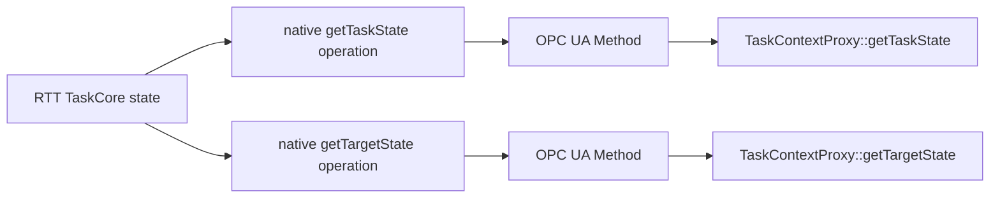

# Native RTT Task State Operations Design

Date: 2026-08-14

> [!IMPORTANT]
> Status: Planned and not implemented. This page is not part of the current
> install contract.

## TODO

- [ ] Register `getTaskState()` and `getTargetState()` as native RTT operations.
- [ ] Register and transport the existing `TaskState` type generically.
- [ ] Make `TaskContextProxy` use the two native operations.
- [ ] Remove the transport-only `lifecycleState` Variable.
- [ ] Verify current and target state during normal and transitional states.

## Purpose

Expose the existing RTT current and target task-state getters through the
native `TaskContext` operation interface, then let the generic OPC UA operation
mapper transport them.

This removes the synthetic OPC UA `lifecycleState` Variable while preserving
accurate `TaskContextProxy` lifecycle behavior.

> [!IMPORTANT]
> The OPC UA component model must contain only resources discoverable from the
> native RTT service model. Transport-only component children are not allowed.

## Current Problem

`RTT::base::TaskCore` already provides the side-effect-free C++ methods
`getTaskState()` and `getTargetState()`. `TaskContext::setup()` does not
register them as RTT operations, so they are absent from `provides()` and
cannot be handled by the generic operation mapper.

`rtt_opcua` currently fills that gap with a read-only String Variable:

```text
rtt/components/<component>/lifecycleState
```

`TaskContextProxy` reads that Variable to implement `getTaskState()`, derives
several lifecycle predicates from it, and incorrectly implements
`getTargetState()` by returning the current state. The extra Variable is useful
to the proxy but does not exist in the native RTT model.

## Decision

RTT will expose both getters as ordinary component-root operations:

```text
component.provides()
`- Operations
   |- getTaskState() -> TaskState
   `- getTargetState() -> TaskState
```

The existing generic OPC UA operation mapper then publishes both as Methods:

```text
rtt/components/<component>/operations/getTaskState
rtt/components/<component>/operations/getTargetState
```

The synthetic `lifecycleState` Variable and its dedicated server and client
code are removed.



## Native RTT Contract

`TaskContext::setup()` registers both existing const getters with
`ClientThread`, matching the execution policy used by other read-only root
operations such as `getPeriod` and `getCpuAffinity`.

The operations are observational only. They do not:

- invoke lifecycle hooks;
- request a transition;
- start or stop an activity;
- schedule component work; or
- modify current or target state.

`getTaskState()` returns the state currently occupied. `getTargetState()`
returns the transition destination while a transition is in progress and the
current state otherwise. The two values can therefore differ during a
lifecycle hook.

Adding these operations reserves their names at the component root. A
downstream component that already registers a custom root operation with
either name must remove or rename that custom operation. No collision exists
in the maintained workspace.

## TaskState Type Contract

The existing `RTT::base::TaskCore::TaskState` type is registered in the RTT
typekit as `TaskState`. This is registration of an existing public type, not a
new state enum and not an ABI change to `TaskCore`.

The existing numeric values remain authoritative:

| Code | RTT state |
| ---: | --- |
| `0` | `Init` |
| `1` | `PreOperational` |
| `2` | `FatalError` |
| `3` | `Exception` |
| `4` | `Stopped` |
| `5` | `Running` |
| `6` | `RunTimeError` |

No String representation crosses the RTT or OPC UA boundary. Human-readable
state names remain suitable for logs, TaskBrowser presentation, and
documentation.

The RTT typekit does not add unscoped global state-name constants. This keeps
the global scripting namespace unchanged and avoids collisions with
application names.

## OPC UA Type Contract

`rtt_opcua` registers a canonical protocol for RTT `TaskState` using the OPC UA
built-in scalar `Int32` datatype. Operation metadata retains the canonical RTT
type name `TaskState`.

Encoding and decoding must accept only codes `0` through `6`. An out-of-range
code is a schema error, not an unknown state and not a value to preserve.

> [!NOTE]
> A dedicated OPC UA Enumeration DataType can be reviewed later. The stable
> initial contract uses documented `Int32` codes, consistent with other RTT
> status enums.

Because these are ordinary operations, the existing operation dispatcher owns
thread handoff, bounded timeout behavior, exception translation, lifetime
guards, and method-schema publication. No lifecycle-specific OPC UA callback
is introduced.

## TaskContextProxy Contract

The proxy implements each C++ getter by invoking its same-named remote method:

| Proxy API | Remote RTT operation |
| --- | --- |
| `getTaskState()` | `getTaskState` |
| `getTargetState()` | `getTargetState` |

The proxy validates that the Method returns exactly one scalar `Int32` result
whose code belongs to `TaskState`. A failed call, incompatible result, or
unknown code marks the remote interface stale, records a diagnostic, and
returns `TaskCore::Init` as the existing failure fallback.

Lifecycle predicates call their corresponding native Boolean operations
directly:

- `isConfigured`;
- `isActive`;
- `isRunning`;
- `inFatalError`;
- `inException`; and
- `inRunTimeError`.

They are not derived from enum ordering in the proxy.

`ready()` requires a synchronized interface and connected session, then calls
the native `getTaskState` operation as a side-effect-free liveness probe. The
returned state does not determine readiness; successful access to the mapped
component does. This retains stale-component detection without synthetic
metadata.

## Compatibility

This is a coordinated RTT and `rtt_opcua` interface revision:

- the new RTT typekit provides `TaskState` type information;
- every new RTT `TaskContext` provides both state operations;
- the new publisher omits `lifecycleState`; and
- the new proxy requires the native operations.

There is no fallback to the legacy String Variable and no dual publication.
RTT, `rtt_opcua`, and OCL artifacts from the installed prefix must be upgraded
together.

## Failure Handling

Native getter calls do not fail under ordinary local RTT execution. Transport
failures retain the existing proxy behavior:

- missing Methods or invalid schemas fail proxy synchronization;
- call timeouts and OPC UA failures mark the interface stale;
- invalid state codes are rejected with the operation name and code in the
  diagnostic; and
- `synchronize()` is required before using a stale interface again.

Publication preflight fails if `TaskState` lacks RTT type information or an
OPC UA codec. It must never publish either operation as `unknown_t`.

## Verification Contract

Maintained RTT tests prove:

- both operations appear on every ordinary `TaskContext` root service;
- both report RTT type `TaskState`;
- calling them does not change lifecycle state;
- current and target state differ as documented during a transition; and
- the RTT type repository resolves `TaskState` without `unknown_t`.

Maintained `rtt_opcua` tests prove:

- `TaskState` encodes as scalar `Int32` for every valid code;
- invalid codes are rejected;
- both native operations publish through the generic operation mapper;
- no `lifecycleState` child exists below a component;
- proxy current and target state match the remote component;
- lifecycle predicates call successfully through their native operations;
- `ready()` detects an unavailable published component; and
- existing operation, sparse-category, lifetime, and reconnect tests pass.

OCL integration and the temporary interface probe prove that TaskBrowser lists
both native operations, can call them, and does not display a synthetic
`lifecycleState` component child.

## Non-Goals

This design does not:

- change the existing C++ `TaskState` enum definition or numeric values;
- add writable lifecycle state;
- add global state constants to RTT scripting;
- define publication selectors or permissions;
- introduce a dedicated OPC UA Enumeration DataType; or
- preserve mixed-version compatibility with the synthetic Variable.
