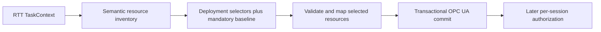

# OPC UA Selective Component Publication Design

Date: 2026-08-15

> [!IMPORTANT]
> Status: Planned and not implemented. This page is not part of the current
> install contract.

> [!WARNING]
> This design intentionally changes `opcua.start()` from "start and publish the
> complete Deployer" to "start an endpoint with no published RTT components."
> Every component, including the Deployer, must then be published explicitly.

## TODO

- [ ] Separate semantic RTT resource discovery from OPC UA validation and mapping.
- [ ] Add exact, single-segment, and recursive publication selectors.
- [ ] Add mandatory RTT proxy resources and selected-only validation.
- [ ] Expose selective publication and complete diagnostics through OCL.
- [ ] Make Deployer publication explicit after endpoint startup.
- [ ] Prove full and selected publication through temporary installed-prefix tests.

## Stable Contracts

Implementation must preserve the repository boundary in
[Architecture](../architecture.md), the RTT resource meanings and static
publication rules in the [Native OPC UA Reference](../opcua-reference.md), and
the downstream artifact guarantees in the
[Install Contract](../install-contract.md).

The current complete `publishComponent(name)` behavior remains available. This
design adds a deployment-owned way to publish a strict subset without moving
application policy into Orocos component code. The later
[OPC UA PKI And Authorization](./opcua-security-prd.md) contract operates only
on resources that this publication layer has made present.

## Problem Statement

The current native OPC UA integration publishes the complete supported RTT
interface of a component. A deployment can choose which components to publish,
but it cannot choose which operations, properties, attributes, ports, or
services of one component enter the address space.

This is too coarse for components that contain both a reviewed remote interface
and internal implementation resources. Publishing the component exposes both.
Moving publication annotations into the component would couple reusable RTT
code to one deployment's remote-access policy, while filtering OPC UA nodes
after they are created would weaken atomic publication and duplicate mapping
rules.

The current mapping pipeline also validates every discovered resource before
publication. A component therefore cannot expose a supported public subset when
an unrelated, unselected resource uses a type that has no OPC UA codec.

## Solution

Add a deployment-wide allowlist evaluated between semantic RTT discovery and
OPC UA validation:



The deployment supplies selectors directly when publishing:

```text
opcua.publishComponentSelected("rt_api", selectors)
```

Unselected resources do not create OPC UA nodes and are not validated for OPC
UA type or method-schema support. The selection applies to every client of that
endpoint. It is not a per-user authorization rule.

## Goals

- Select individual RTT operations, properties, attributes, ports, and services.
- Select a complete service subtree with one recursive selector.
- Keep resource selection in deployment configuration rather than component code.
- Preserve complete publication through the existing API.
- Preserve static, atomic, idempotent component publication.
- Validate only selected resources and the mandatory proxy baseline.
- Keep ports and their same-named RTT-generated services independently selectable.
- Keep selected components usable through `TaskContextProxy` and
  `ctaskbrowser-opcua`.
- Return complete, deterministic configuration diagnostics.
- Make every component publication explicit, including the Deployer.
- Keep generic Orocos code free of MetaNC resource names and policy.

## Ownership Boundary

`rtt_opcua` owns:

- semantic resource inventory construction;
- selector parsing, matching, and normalization;
- the mandatory RTT proxy baseline;
- selected-resource validation and mapping;
- publication-mode and selection fingerprints; and
- structured publication diagnostics.

OCL owns:

- the `publishComponentSelected` deployment operation;
- conversion of structured diagnostics into RTT-script-visible strings;
- explicit Deployer publication after endpoint startup; and
- installed executable and TaskBrowser integration tests.

Downstream deployments own the selector arrays supplied for their components.
Orocos does not recognize application naming conventions, decide which
application service is public, or load a product policy file.

## Publication Pipeline

### Phase 1: Semantic inventory

The publisher recursively discovers the complete RTT resource graph without
requiring OPC UA codecs or constructing OPC UA nodes. Each logical resource is
represented by an inventory record containing at least:

```text
ResourceRecord
|- canonical resource path
|- resource kind
|- owning service path
|- RTT source reference
`- documentation
```

Resource kinds are:

- operation;
- property;
- attribute or constant;
- port; and
- service.

The component object, category objects, method argument metadata, `rttType`
properties, port metadata, and port `value` Variable are structural mapping
output. They are not independent selectable resources.

Discovery records resource-local structural problems against their canonical
paths instead of immediately failing the component. Examples include a cyclic
service, a service beyond the maintained depth limit, or a port that cannot be
classified as exactly input or output. A problem fails publication only when
the affected resource is selected or mandatory.

A failure that prevents a trustworthy inventory from being constructed fails
regardless of selection. This includes failure to obtain the component root
service or failure to assign unambiguous canonical identities.

### Phase 2: Selection

The selector engine parses every supplied selector and matches it against the
semantic inventory. It then adds the mandatory RTT proxy resources and the
structural ancestors needed by the matched resources.

The result is a normalized set of logical resource paths. Selector spelling,
order, duplication, and overlap do not affect that effective set.

### Phase 3: Validation and mapping

Only resources in the effective set are passed to datatype lookup, operation
schema construction, port validation, callback creation, and OPC UA `NodeSpec`
mapping. Each selected resource produces its complete atomic node bundle.

Mapping retains the current resource meanings from the Native OPC UA Reference.
Selection does not create an alternative operation, property, attribute, port,
or service mapper.

### Phase 4: Transactional commit

The selected `NodeMap` uses the existing component lifetime guards, rollback
ledger, deterministic fingerprinting, and all-or-nothing server commit. No
component node remains after a failed publication attempt.

## Selector Contract

### Canonical paths

Selectors are case-sensitive paths relative to the component root. They reuse
the existing deterministic resource categories:

```text
operations/start
properties/Gain
attributes/Mode
ports/command
services/automatic/operations/execute
services/automatic/services/diagnostics/operations/reset
```

Nested services repeat the `services` category segment. Component names are not
part of a selector because the component is supplied separately to
`publishComponentSelected`.

RTT names containing reserved path or wildcard characters use the same
per-segment percent escaping as deterministic OPC UA NodeIds. Selectors use the
canonical uppercase hexadecimal form produced by `escapeNodeIdSegment`; they do
not accept alternative encodings of the same bytes. A literal `*` in an RTT
name is escaped as `%2A`; an unescaped `*` remains a selector wildcard.

### Matching forms

The first version supports only three forms:

| Form | Meaning | Example |
|---|---|---|
| Exact path | One logical resource | `ports/command` |
| `*` segment | Exactly one path segment | `operations/*` |
| Terminal `**` | Zero or more remaining segments | `services/automatic/**` |

`**` is valid only as the last segment. Selectors are glob-style resource
paths, not regular expressions. Negation, deny rules, character classes, and
mid-path recursive wildcards are rejected.

An exact service path selects the service object but none of its children.
`services/automatic/**` selects the `automatic` service object and every
logical resource in its subtree. `services/*/**` selects every direct service
and each complete subtree.

Category paths such as `operations` do not identify logical resources and do
not match. Deployments use `operations/*` to select all root operations.

### Match requirements

- The selector array must contain at least one selector.
- Every supplied selector must match at least one logical resource.
- One malformed or unmatched selector rejects the complete publication.
- Duplicate and overlapping selectors are accepted and deduplicated.
- Mandatory resources do not make an empty selector array valid.
- Selection is case-sensitive.

These rules catch misspelled deployment policy instead of silently publishing a
smaller interface than the reviewed configuration describes.

## Atomic Resource Bundles

Selectors target RTT resources rather than individual implementation nodes.

Selecting an operation includes:

- its OPC UA Method;
- input and output argument metadata;
- canonical RTT type metadata; and
- required category and service ancestors.

Selecting a property, attribute, or constant includes its Variable, access
semantics, `rttType` metadata, and required ancestors.

Selecting a port includes its Object, `type`, `direction`, `description`, the
canonical `value` Variable when that port supports one, and required ancestors.
A selector cannot independently include or exclude `ports/command/value`.

Selecting a service includes its service Object and required ancestors. Its
children are selected only by another exact/wildcard selector or terminal
`/**`.

### Ports and generated services

The canonical port data plane and the RTT-generated port service remain
separate logical resources:

```text
ports/command
services/command/**
```

Selecting the port does not select generated operations such as `read`,
`clear`, `write`, or `last`. Selecting the generated service does not select the
canonical port `value` surface.

## Mandatory RTT Proxy Baseline

Every selected publication includes these root operations:

```text
operations/getTaskState
operations/getTargetState
operations/isConfigured
operations/isActive
operations/isRunning
operations/inFatalError
operations/inException
operations/inRunTimeError
```

They are read-only lifecycle queries required by the maintained
`TaskContextProxy` contract. This is an Orocos remote-TaskContext requirement,
not an OPC UA protocol requirement.

The operations, method schema metadata, and structural ancestors are added even
when no user selector matches them. They cannot be excluded. Missing or
incompatible mandatory operations reject publication. Mutating lifecycle
operations such as `configure`, `start`, `stop`, `cleanup`, and `recover` remain
ordinary selectable resources.

This baseline lets `ctaskbrowser-opcua` construct a faithful proxy, check
connection readiness, and display TaskContext state without silently inventing
lifecycle values.

## Public APIs

### `rtt_opcua`

The existing API remains source compatible:

```cpp
bool ObjectModel::publishComponent(
    RTT::TaskContext& component,
    std::string* error = nullptr,
    std::vector<UnsupportedResource>* unsupported = nullptr);
```

Selective publication adds an explicit operation rather than overloading the
meaning of an empty selector array:

```cpp
bool ObjectModel::publishComponentSelected(
    RTT::TaskContext& component,
    const std::vector<std::string>& selectors,
    std::string* error = nullptr,
    std::vector<PublicationDiagnostic>* diagnostics = nullptr);
```

`PublicationDiagnostic` identifies the diagnostic kind, optional selector,
optional resource path, and reason. Its `message()` representation is stable
and deterministic for OCL and logs.

The object model also exposes diagnostics from the most recent attempt for a
component:

```cpp
std::vector<PublicationDiagnostic>
publicationDiagnostics(std::string_view component) const;
```

### OCL

The deployment service adds:

```text
bool publishComponentSelected(String component, StringArray selectors)
StringArray publicationDiagnostics(String component)
```

`publishComponent` and `unsupportedResources` remain available. The latter
continues to report only selected or mandatory resources rejected for mapping
support; selector and publication-mode errors appear in
`publicationDiagnostics`.

No named publication profiles, configuration files, or component annotations
are added.

## Endpoint Startup Contract

`opcua.start()` becomes endpoint-only. It:

1. registers and freezes the process-wide datatype registry;
2. starts the configured OPC UA listener;
3. constructs an empty object model; and
4. returns success without publishing an RTT component.

Every component is then explicit, including the Deployer:

```text
opcua.start()
opcua.publishComponentSelected("Deployer", deployer_selectors)
opcua.publishComponentSelected("rt_api", rt_api_selectors)
opcua.publishComponent("diagnostic_fixture")
```

`publishComponent("Deployer")` remains the explicit way to publish the complete
Deployer interface.

This is an intentional breaking change. Existing scripts that rely on
`opcua.start()` to publish the Deployer must add an explicit publication call.
The stable user guide, reference, install contract, fixtures, and installed
acceptance tests must change in the implementation that ships this behavior.

A failed component publication leaves the endpoint running and leaves earlier
successful publications unchanged. The failed component has no residual
subtree. This design does not add a public stop or restart operation.

## Static Publication And Idempotence

The published record stores:

- the component instance;
- full or selected publication mode;
- the normalized effective resource set for selected mode;
- the mapped node fingerprint; and
- guarded callback state.

Repeating selected publication for the same live component and the same
effective resource set is a successful no-op. Selector order, duplicates, and
overlap do not affect equivalence.

The following attempts fail:

- selected republication with a different effective resource set;
- full publication after selected publication;
- selected publication after full publication; and
- publication of a different component instance under an existing name.

If the live RTT interface changes so that the same wildcard selectors produce a
different effective set, republication fails rather than reconciling the
address space. Applying a changed selection requires endpoint/process restart.
There is no unpublish, replacement, or live policy update.

## Validation And Failure Behavior

Validation applies to the mandatory baseline and effective selected set only.
It covers:

- resource identity and canonical path safety;
- datatype codec availability and value support;
- operation argument and result schemas;
- port direction and canonical value surface;
- service depth and cycle safety; and
- deterministic NodeId and callback construction.

An unsupported unselected resource does not reject publication and does not
appear in `unsupportedResources` for that attempt.

All selector and validation errors are collected before commit and returned in
deterministic order. `lastError()` contains a concise attempt summary.
`publicationDiagnostics(component)` contains all detailed failures, including:

- malformed selectors;
- each unmatched selector;
- selected unsupported resources;
- mandatory baseline failures;
- selected service cycles or depth violations; and
- incompatible republication mode or selection.

A successful publication, including an idempotent repeat, clears cached failure
diagnostics for that component. Logs emit the same diagnostic messages without
changing the queryable result.

## Authorization Relationship

Publication selection and authorization remain separate controls:

1. Publication selection decides whether a resource exists in the endpoint.
2. Authorization later decides whether a session may browse, observe, write,
   or call an existing resource.

The published set is the upper bound. Authorization cannot grant an unselected
resource because its NodeId does not exist. Mandatory lifecycle-query nodes are
published but may still be restricted by later authorization policy.

## Testing Decisions

### Selector and inventory tests

Maintained `rtt_opcua` tests prove:

- exact, `*`, and terminal `**` matching;
- canonical percent escaping and literal wildcard names;
- rejection of empty, malformed, and partially unmatched selector arrays;
- deterministic matching and diagnostics independent of selector order;
- duplicate and overlapping selector deduplication;
- automatic inclusion and validation of every mandatory operation;
- exact service selection versus recursive service selection;
- independent port and generated-service selection; and
- complete atomic node bundles for each resource kind.

### Validation and transaction tests

Tests use a generic component containing supported and unsupported resources to
prove:

- an unsupported unselected resource is ignored;
- selecting that resource rejects the component;
- unselected deterministic NodeIds return `BadNodeIdUnknown`;
- one selector error commits no component nodes;
- an injected node-creation failure rolls back the selected subtree;
- same-selection publication is idempotent;
- changed-selection and full/selected mode switches fail; and
- interface changes that alter wildcard matches do not reconcile publication.

Existing complete-publication, lifetime, timeout, rollback, and shutdown tests
remain green through the shared mapping pipeline.

### OCL and client tests

OCL integration tests prove:

- `opcua.start()` publishes no Deployer or peer component;
- complete Deployer publication works explicitly;
- selected Deployer publication works explicitly;
- selected peer publication returns all selector diagnostics;
- `TaskContextProxy` reconstructs exactly the selected RTT interface plus the
  mandatory baseline; and
- `ctaskbrowser-opcua` connects and lists selected resources without requiring
  mutating lifecycle operations.

### Installed-prefix acceptance

A fresh temporary prefix and temporary home are used to:

1. start an endpoint with no RTT components;
2. prove the Deployer is initially absent;
3. explicitly publish selected Deployer and fixture components;
4. connect separate direct-client and TaskBrowser processes;
5. prove selected nodes are usable and unselected NodeIds are absent;
6. prove a misspelled selector fails with complete diagnostics;
7. prove full publication remains available; and
8. shut down without leaving a server process or persistent state.

GNU/Linux runtime tests and the Xenomai build/install contract remain covered.
Security logic and selector evaluation stay outside real-time execution paths.

## Acceptance Criteria

- `publishComponentSelected` publishes only matched logical resources, the
  mandatory baseline, and structural ancestors.
- Exact, `*`, and terminal `**` selectors follow the documented canonical path
  grammar.
- Empty, malformed, or unmatched selector arrays fail before commit.
- Unselected resources are not type- or schema-validated.
- Ports and same-named generated services remain independently selectable.
- Every selected resource maps as one complete atomic bundle.
- The eight mandatory lifecycle-query operations always exist with compatible
  schemas.
- `TaskContextProxy` and `ctaskbrowser-opcua` work against selected publication.
- `publicationDiagnostics` returns all failures in deterministic order.
- Repeating an equivalent selection succeeds; changing mode or effective
  selection fails until restart.
- `opcua.start()` publishes no RTT component.
- Complete and selected Deployer publication both require explicit calls and
  both work.
- Existing `publishComponent` retains complete mapping semantics.
- Later authorization cannot expose an unselected resource.
- Installed validation uses only temporary homes, prefixes, and runtime state.

## Out Of Scope

- deny lists, selector negation, or regular expressions;
- named profiles or external publication-policy files;
- annotations in RTT component source;
- per-user or per-role authorization implementation;
- changing the current RTT-to-OPC-UA meaning of any resource;
- partial or degraded `TaskContextProxy` semantics;
- live selector changes, unpublication, replacement, or reconciliation;
- public endpoint stop, restart, or reconfiguration operations;
- MetaNC-specific service names or product policy;
- changes to RTT core, open62541, or open62541pp source; and
- enabling third-party dependency test suites.

## Further Notes

The historical complete-interface mapping design established the "complete
before selective" principle. This design retains that principle while updating
the mapping baseline to the current canonical port `value` contract and native
task-state operations documented in the stable reference.

Implementation should begin from current `main`, not from the historical
`opcua-native-task-state-plan` worktree. That worktree predates the canonical
value-only dataport and input-readback contracts and contains no unique commits.
