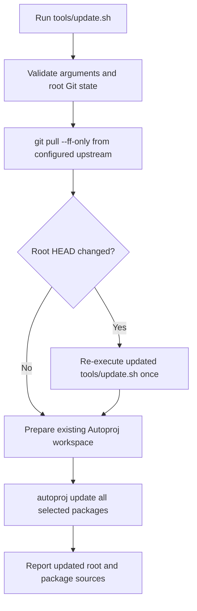

# Workspace Source Update Command

Date: 2026-08-15

This design defines a single command that updates the `rock-orocos` root and
its complete Autoproj-managed package layout without building or installing the
toolchain.

> [!IMPORTANT]
> Status: Planned and not implemented. This page is not part of the current
> install contract. Until it is implemented, update the root with
> `git pull --ff-only` and use the existing Autoproj commands manually.

## TODO

- [ ] Add the safe root fast-forward and single re-execution flow.
- [ ] Update the complete configured Autoproj layout without building.
- [ ] Add isolated shell regression tests for success and failure paths.
- [ ] Add repository policy enforcement for the update-only contract.
- [ ] Replace this planned chapter with durable user and maintainer guidance.

## Stable Contracts

Implementation must preserve the configured fork and tag selections in
[Package Policy](../package-policy.md), the separate organization lineages in
[Dual-Organization Publication](../dual-organization-publication.md), and the
workspace versus installed-prefix boundary in
[Install Contract](../install-contract.md).

## Goal

Add this command:

```bash
./tools/update.sh --prefix ~/.orocos --target gnulinux
```

The command updates the current root branch from its configured Git upstream,
then updates every package selected by the current Autoproj workspace.

"Latest" means the latest commit allowed by the tracked source policy:

- branch selections advance to the configured branch tip;
- tag selections remain pinned to the configured tag; and
- the active root variant determines whether maintained packages use
  `liufang-robot` or `OptimalCNC` repositories.

## Non-Goals

The command does not:

- build or install packages;
- install operating-system dependencies;
- update Ruby Bundler or Autoproj itself;
- discover and update arbitrary Git repositories below `toolchain/`;
- publish commits to either organization;
- reset, force-reset, stash, discard, or rewrite local work; or
- reconcile divergent Git histories.

## Command Interface

The command accepts the same workspace selectors as the existing setup and
install commands:

```text
Usage: ./tools/update.sh [--prefix PREFIX] [--target gnulinux|xenomai]
```

Defaults remain `$OROCOS_PREFIX` or `~/.orocos` for the prefix and
`$OROCOS_TARGET` or `gnulinux` for the target. Unknown arguments and missing
option values are errors.

## Update Flow



### Root Phase

Before contacting the root upstream, the command requires:

- a named current branch;
- a configured tracking branch; and
- no tracked, staged, or non-ignored untracked root changes.

It then runs the equivalent of `git pull --ff-only`. A detached branch,
missing upstream, dirty root, or non-fast-forward relationship stops the
command without modifying package checkouts.

If the root commit changes, the command re-executes the updated copy of itself
exactly once with the original arguments. The second execution verifies that
the re-execution marker names the current root commit before skipping the root
phase. This ensures refreshed helpers, package policy, and command behavior are
used for package updates.

### Autoproj Phase

After the root phase, the command loads the refreshed `tools/common.sh`, checks
that Autoproj is usable, applies the requested Orocos target, and prepares the
existing workspace configuration without OS dependency installation.

It updates the complete selected layout with non-interactive Autoproj options
that explicitly disable configuration, Bundler, Autoproj, and osdeps updates.
No package list is duplicated in the shell script; the tracked Autoproj layout
and overrides remain the source of truth.

The update must not pass `--reset` or `--force-reset`. Autoproj remains
responsible for detecting local package changes, local commits, and divergent
histories. Any rejected package update stops the command and preserves the
affected checkout.

> [!NOTE]
> Updates span independent Git repositories and are not transactional. A later
> package failure does not roll back an earlier root or package fast-forward.
> The command reports the failure and leaves every completed fast-forward in
> place.

## Output And Exit Status

Progress messages identify the root update and the Autoproj package update as
separate phases. Successful completion exits with status `0`. Argument,
preflight, Git, workspace, or Autoproj failures return a nonzero status and the
underlying diagnostic remains visible.

## Acceptance Criteria

Automated shell tests use temporary Git repositories and a fake Autoproj
launcher. They must verify:

1. a clean root fast-forwards and then invokes the package update with the
   required non-interactive, no-build options;
2. a changed root re-executes the refreshed script only once;
3. dirty root state is rejected before either update phase;
4. a missing upstream or non-fast-forward root update is rejected;
5. package update failure is propagated without any reset option; and
6. prefix, target, help, and invalid-argument handling match the documented
   interface.

Repository policy tests must require the command and its regression test,
reject destructive Autoproj reset flags, and confirm that the command does not
invoke a build. Shell syntax, root policy checks, and mdBook generation must
remain green.

## Documentation Lifecycle

When the command ships:

- document normal usage in the User Guide;
- document update-only versus build/install behavior in the Maintainer Guide;
- remove this planned-work chapter; and
- keep the source-policy and dual-organization rules unchanged.
